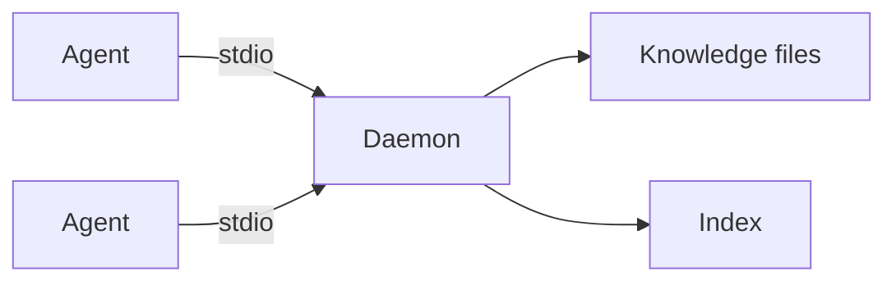
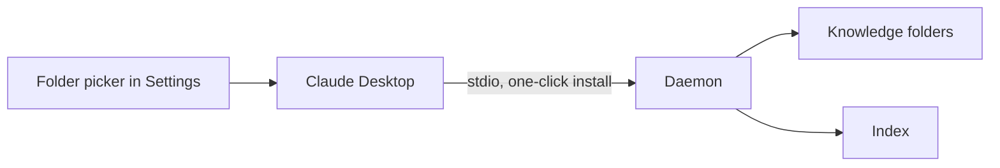
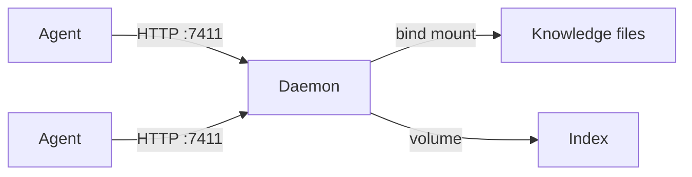
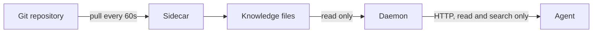
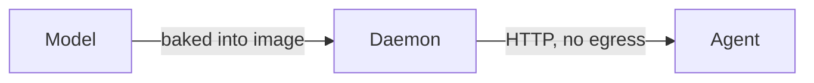
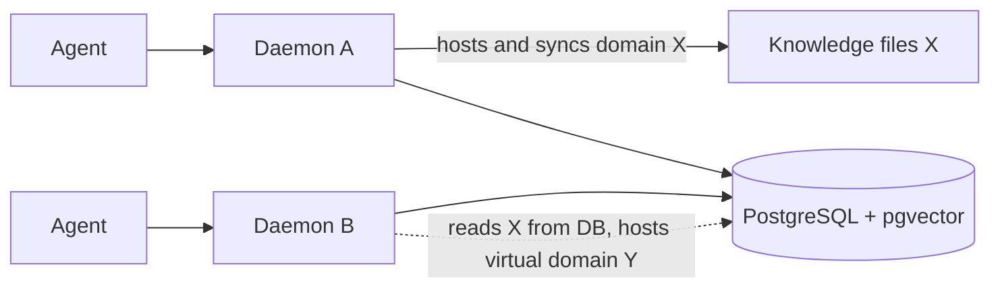
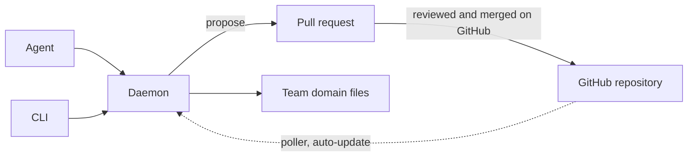

```
                                   ·              *
                                 ▄▄▄▄▄▄▄▄▄▄▄▄▄▄▄▄▄▄▄▄▄
                                ▐░░░▒▒▒▒▓▓▓█▓▓▓▒▒▒▒░░░▌
                                 ▀█░░░▒▒▒▓▓█▓▓▒▒▒░░░█▀   ·
                                   ▀█░░▒▒▒▓█▓▒▒▒░░█▀
                            *        ▀█░▒▒▓█▓▒▒░█▀
                                       ▀█▒▒█▒▒█▀
                                         ▀███▀     ·
                                           ▀

 ██████╗██████╗ ██╗   ██╗███████╗████████╗ █████╗ ██╗     ██╗     ██╗███╗   ██╗███████╗
██╔════╝██╔══██╗╚██╗ ██╔╝██╔════╝╚══██╔══╝██╔══██╗██║     ██║     ██║████╗  ██║██╔════╝
██║     ██████╔╝ ╚████╔╝ ███████╗   ██║   ███████║██║     ██║     ██║██╔██╗ ██║█████╗
██║     ██╔══██╗  ╚██╔╝  ╚════██║   ██║   ██╔══██║██║     ██║     ██║██║╚██╗██║██╔══╝
╚██████╗██║  ██║   ██║   ███████║   ██║   ██║  ██║███████╗███████╗██║██║ ╚████║███████╗
 ╚═════╝╚═╝  ╚═╝   ╚═╝   ╚══════╝   ╚═╝   ╚═╝  ╚═╝╚══════╝╚══════╝╚═╝╚═╝  ╚═══╝╚══════╝
```

[](https://github.com/jordiboehme/crystalline/actions/workflows/ci.yml)
[](LICENSE)
[](https://github.com/jordiboehme/crystalline/releases/latest)

An AI agent starts every session as a stranger: no memory of yesterday's decisions, no sense of which conventions the team already settled on, everything re-derived from scratch via Markdown files, expensive exploration or re-explained by a person. Crystalline gives an agent a durable memory instead. It is onboarded with a routing prompt at session start, taught curated knowledge organized into Domains and captures what it learns while it works as Engrams - so it becomes a more useful and productive peer over time instead of a stranger every time.

Crystalline is a single Rust binary: a CLI for people, an MCP server for agents, and a local search index that sits on top of plain markdown files.

## Why Crystalline

Crystalline is the evolution of approaches that many teams have walked through in the same order. Giving an agent a single markdown file of instructions works, until it grows past what fits in context. Splitting it into a folder of markdown files works, until nobody can tell which file to read for a given task. Adding index files that point at folders and other files works, until maintaining the pointers becomes its own job and every lookup still means walking a tree by hand. Each step scales further than the last, and each one quietly breaks somewhere in the hundreds of files.

Once knowledge grows into the thousands or tens of thousands of units, reading and pointer-walking stop being viable at all. What is needed at that scale is what any large knowledge system needs: real indexes. Crystalline keeps the plain markdown files - they remain the source of truth, readable and diffable - and adds domain routing, full-text and semantic search, a knowledge graph and temporal filtering on top, so the ten-thousandth engram is exactly as findable as the tenth.

## How it works

- **Domains** are folders of knowledge. Each one carries a `MANIFEST.md` describing its scope and when an agent should route a task there.
- **Engrams** are the unit of knowledge: one markdown file with YAML frontmatter, holding prose, observations (`- [category] a captured fact or lesson`) and relations (`- rel_type [[Other Engram]]`) to other engrams.
- **Built on an open format.** The engram format extends [Google's Open Knowledge Format (OKF)](https://github.com/GoogleCloudPlatform/knowledge-catalog/tree/main/okf): plain markdown with YAML frontmatter where unknown keys are always preserved. Crystalline layers its routing, temporal and knowledge-graph conventions on top, so engrams stay readable by any OKF tooling and OKF documents drop into a domain with minimal ceremony.
- **MANIFEST routing** lets an agent (or a person) figure out which domain owns a task without reading every file: `crystalline prompt system` turns each domain's `## When to Use` bullets into a compact session-start briefing.
- **One truth per domain.** By default files are truth: engrams on disk are the durable state and nothing lives only in the database.* The search index is always derived and disposable, whichever side holds the truth.

  *Unless you ask for exactly that: a virtual domain keeps its engrams in the database instead of on disk, for deployments where a filesystem is baggage rather than a feature. The principle does not bend - it just lets you pick which side of it your domain lives on, and `crystalline domain export` hands the files back whenever you change your mind.
- **The index is disposable.** Crystalline maintains a database for fast text, tag, temporal and semantic search. For a file domain it is fully derived from the markdown files and rebuilt on demand with `crystalline reindex --full`; for a virtual domain the same tables hold the source of truth, so `reindex --full` rebuilds the file domains around it and never touches it. Corruption or a schema change is never a data-loss event.

## Install

macOS, via [Homebrew](https://brew.sh):

```sh
brew install jordiboehme/tap/crystalline
```

Linux, via `.deb` (Debian, Ubuntu and derivatives, amd64 or arm64):

```sh
version=$(curl -fsSL https://api.github.com/repos/jordiboehme/crystalline/releases/latest | grep -m1 '"tag_name"' | cut -d '"' -f4)
arch=amd64   # or arm64
curl -fsSLO "https://github.com/jordiboehme/crystalline/releases/download/${version}/crystalline_${version#v}_${arch}.deb"
sudo dpkg -i "crystalline_${version#v}_${arch}.deb"
# or: sudo apt install "./crystalline_${version#v}_${arch}.deb"
crystalline --version
```

Claude Desktop, via MCP Bundle - one click, no terminal needed:

Download the `.mcpb` file for your platform from the [latest release](https://github.com/jordiboehme/crystalline/releases/latest), then in Claude Desktop open Settings > Extensions > Advanced settings > Install Extension... and pick the file. Choose your knowledge folders in the extension settings; Crystalline prepares each folder as a domain automatically. See the Claude Desktop extension scenario under Deployment scenarios below.

Anywhere else, download a prebuilt binary from the [latest release](https://github.com/jordiboehme/crystalline/releases/latest). Four platforms are published:

| Platform | Archive |
|---|---|
| macOS (Apple Silicon) | `macos-arm64` |
| Linux x86_64 (statically linked) | `linux-amd64` |
| Linux arm64 (statically linked) | `linux-arm64` |
| Windows x86_64 | `windows-amd64` |

Each archive is named `crystalline-<version>-<platform>.tar.gz` (`.zip` on Windows) and contains the `crystalline` binary alongside `LICENSE` and `README.md`. A `SHA256SUMS` file is attached to every release for verification.

Shell one-liner (macOS/Linux, adjust `platform` to match your platform):

```sh
version=$(curl -fsSL https://api.github.com/repos/jordiboehme/crystalline/releases/latest | grep -m1 '"tag_name"' | cut -d '"' -f4)
platform=macos-arm64
curl -fsSL "https://github.com/jordiboehme/crystalline/releases/download/${version}/crystalline-${version}-${platform}.tar.gz" \
  | tar xz -C /tmp
sudo mv "/tmp/crystalline-${version}-${platform}/crystalline" /usr/local/bin/crystalline
crystalline --version
```

### Build from source

```sh
git clone https://github.com/jordiboehme/crystalline.git
cd crystalline
cargo build --release
```

The resulting binary is at `target/release/crystalline`.

## Quickstart

This runs verbatim, start to finish, on a clean machine.

```sh
# 1. Create a domain: a folder of knowledge with a MANIFEST.md at its root.
#    domain add indexes whatever is already there (the manifest, for now)
#    right away, no separate sync step needed.
mkdir -p ~/knowledge/engineering
crystalline domain init ~/knowledge/engineering --name engineering
crystalline domain add engineering ~/knowledge/engineering

# 2. Capture an engram: a unit of knowledge, with an observation bullet.
crystalline write engineering "Retry queue gotcha" \
  --content "- [gotcha] The retry queue drops jobs older than 24h #payments" \
  --tags gotcha,payments

# 3. Search it back (plain text, since no embeddings exist yet).
crystalline search "retry queue"

# 4. Fetch the local embedding model once, then re-sync with embeddings.
crystalline model download
crystalline sync --embed

# 5. Search again: hybrid text-plus-semantic ranking now finds the engram
#    from a differently worded description of the same problem.
crystalline search "why does the payments queue lose jobs"

# 6. See what got indexed.
crystalline status
```

Engrams written through Crystalline are indexed immediately; `crystalline sync` only picks up files created outside it (an editor, a `git pull`) when no daemon is watching them.

Edit `~/knowledge/engineering/MANIFEST.md`'s `## Scope` and `## When to Use` sections so routing and the session prompt describe the domain accurately - that file is what `crystalline prompt system` and an agent's routing decisions read.

## Connect your agent

Crystalline runs as an MCP server over stdio. Any MCP-capable harness works - the server command is always `crystalline mcp`.

Claude Code (registered for all your projects):

```sh
claude mcp add crystalline --scope user crystalline mcp
```

Codex CLI:

```sh
codex mcp add crystalline -- crystalline mcp
```

Claude Desktop: install the `.mcpb` bundle from the Install section above - no manual configuration, knowledge folders are managed in Settings > Extensions.

Any other harness: configure a stdio MCP server that runs `crystalline` with the argument `mcp`.

The first agent to connect starts a background daemon that loads the embedding model once and watches every registered domain for changes; every later connection - other agents, other terminals, other harnesses - attaches to that same daemon instead of starting a second copy. One shared instance, one loaded model, one consistent view of the index, no matter how many agents are talking to it at once.

## Deployment scenarios

Crystalline runs the same way in every scenario: a daemon in the middle keeps one search index in sync with knowledge files on disk, and one or more agents connect to it, whether that connection is a local stdio pipe or a network HTTP endpoint. The seven scenarios below are variations on that one architecture.

### Personal workstation

The default shape: install the binary, point one or more agents at `crystalline mcp` over stdio, and the first connection spawns a background daemon that loads the embedding model once and watches every registered domain. Knowledge lives in ordinary local folders, read-write, so capturing what an agent learns as it works is the entire point. See Connect your agent above for the stdio setup.



### Claude Desktop extension

For someone who never opens a terminal, the `.mcpb` bundle wraps the same binary in a one-click Claude Desktop extension. Claude Desktop renders a native folder picker from the bundle manifest; every picked folder is prepared as a domain automatically, MANIFEST.md included, and `Documents/Crystalline/Personal` is created as the starter domain out of the box. Under the hood Claude Desktop spawns `crystalline mcp --domain <folder>` per picked folder over stdio, landing on the same daemon as the personal workstation shape. Removing a folder from the settings never deletes its knowledge.



### Team server

For a team, run the GHCR image from Run in a container below via `examples/docker/compose.yaml`: the daemon listens on `--http 0.0.0.0:7411` and every agent on the network reaches it over streamable HTTP instead of stdio. Knowledge is bind-mounted from the host so it stays exactly the same markdown files, a `/data` volume holds the disposable index, and the slim `latest` image downloads the model into that same volume once (pick `with-model` instead to skip the download). See Run in a container below for the compose file and image tags.



### Published read-only knowledge base

When a team curates knowledge as a reviewed git repository instead of writing into the container directly, `examples/docker/compose.git-sync.yaml` adds a sidecar that pulls the repository into a shared volume every 60 seconds and mounts it read-only into Crystalline. The daemon runs with `--read-only`, so the four content-mutating tools disappear from the MCP tool list and agents can only search and read, while sync, the file watcher and embedding keep following every pull. A team domain connected to a GitHub origin (see Team knowledge on GitHub below) gets the same effect natively, no sidecar container needed: `update_domain` and `origin_status` stay visible even in read-only mode, so a read-only instance keeps a team domain current on its own background poll schedule. A third option needs no mounted config and no sidecar at all: an immutable image started with `CRYSTALLINE_SERVICE_READ_ONLY=true`, `CRYSTALLINE_GITHUB_ENABLED=true`, one or more `CRYSTALLINE_DOMAIN_<NAME>` and `CRYSTALLINE_DOMAIN_<NAME>_ORIGIN` pairs and `CRYSTALLINE_GITHUB_TOKEN` for a headless sign-in provisions each team domain itself on first start and keeps it current on the same background poll schedule, with nothing left to mount or edit ever again. See Read-only deployments and Configure through environment variables below for the full behavior and variable list.



### Air-gapped or egress-restricted

When a host has no outbound network access, or the first-start model download delay is unwanted for any other reason, use the `with-model` image, or set `CRYSTALLINE_MODELS_DIR` on any install to point at a model directory fetched ahead of time, so nothing in the runtime path ever needs the network. This is orthogonal to read access: combine it with either the read-write team server shape above or the read-only git-sync shape, since air-gapping is about the model rather than about who can write. See Run in a container below for the image variants and `CRYSTALLINE_MODELS_DIR`.



### Shared database collaboration

When several instances should share one index instead of each keeping its own, point them at a shared PostgreSQL database with pgvector using `examples/docker/compose.postgres.yaml`: an immutable image with `CRYSTALLINE_DATABASE_BACKEND=postgres` and `CRYSTALLINE_DATABASE_URL` set, no mounted config.yaml needed. Every instance searches and reads everything in the shared database, so knowledge one instance captures is immediately visible to the rest. Writes follow a single-writer-per-domain rule: each file domain has exactly one hosting instance that syncs and watches its files. Hosting is arbitrated by a host lock with a 30 second heartbeat and a 90 second stale takeover, so a second instance that tries to sync a domain it does not host is refused with the name of the current host and serves that domain read-from-database only. A virtual domain keeps its engrams in the database itself rather than on disk, so it is shared truth that any instance may write, guarded per engram by a compare-and-swap on the checksum so a stale edit is refused rather than silently clobbered. The local-first guarantees hold for a running daemon against a local database; a remote database trades some latency for the federation payoff.



### Team knowledge on GitHub

For a team that keeps a domain in a GitHub repository instead of a shared filesystem or database, each repository (optionally a subfolder of one) becomes a team domain, with an origin recording which repository, subfolder and branch it tracks. Members connect once with a short code confirmed in a browser they are already signed into: no git, no SSH keys and no token to paste for someone who only knows the GitHub web UI. Crystalline shares new knowledge as a proposal the team reviews and merges on GitHub itself, and brings each team domain up to date automatically in the background once its proposals merge; a genuine disagreement between local and team knowledge surfaces as a conflict, settled locally. A fleet of worker or agent hosts can join the same team domain with no interactive connect step at all: three environment variables - `CRYSTALLINE_DOMAIN_<NAME>`, `CRYSTALLINE_DOMAIN_<NAME>_ORIGIN` and `CRYSTALLINE_GITHUB_TOKEN` - register the domain, attach its origin and supply this machine's GitHub identity, so a new node provisions the domain itself and starts polling for updates on first start. See Share knowledge with a team below for the full verb set and the one-time connect flow, and Configure through environment variables below for the fleet variant.



## Run in a container

Crystalline publishes a multi-arch OCI image (`linux/amd64` and `linux/arm64`) to GHCR on every release, for Linux server deployments. macOS and Windows have no OCI container runtime worth targeting here, so those platforms run the native binary from Install above; the container covers the Linux server case.

Two image variants ship under the same name, tag-selected:

| Tag | Size | Embedding model | Best for |
|---|---|---|---|
| `latest` (or a pinned `vX.Y.Z`) | ~15 MB | Downloads in the background on first daemon start (needs egress to huggingface.co once) | The common case: a host with normal internet access, where a short model download on first start is fine |
| `with-model` (or a pinned `vX.Y.Z-with-model`) | ~145 MB | Baked into the image, no download | Air-gapped or otherwise offline hosts, or anywhere semantic search must work from the very first `search` call with no warm-up delay |

Pick `with-model` whenever the host has no outbound network access or the first-start download delay is unwanted; pick the slim `latest` otherwise, since it is the smaller image to pull and update.

```sh
docker pull ghcr.io/jordiboehme/crystalline:latest
# or: docker pull ghcr.io/jordiboehme/crystalline:with-model

docker run -d \
  --name crystalline \
  -p 7411:7411 \
  -v "$(pwd)/knowledge:/knowledge" \
  -v crystalline-data:/data \
  ghcr.io/jordiboehme/crystalline:latest
```

What persists where:

- `./knowledge` (bind mount) holds the engrams of every file domain, one subfolder per domain - the durable state for file-backed knowledge, exactly the same markdown-plus-frontmatter files the native binary reads.
- `crystalline-data` (named volume, mounted at `/data`) holds the search index and the embedding model cache. For file domains it is fully rebuildable: losing it costs a `crystalline reindex --full` and a model re-download (skipped entirely on `with-model`, since its model lives outside `/data` and is never affected by the volume), never data. If you run virtual domains, their engrams are the source of truth and live here too, so back this volume up or `crystalline domain export` them to the bind mount to keep a file copy.

The `with-model` variant sets `CRYSTALLINE_MODELS_DIR` (also settable directly, on any install, to relocate the model cache anywhere else) to a path outside `/data` so the baked model is never shadowed by the `/data` volume mount. The bundled model is [BAAI/bge-small-en-v1.5](https://huggingface.co/BAAI/bge-small-en-v1.5), MIT licensed.

Two sample Compose files ship under [`examples/docker/`](examples/docker/):

- **`compose.yaml`** - the single-container setup above, plus a commented one-shot `domain init` / `domain add` recipe for bootstrapping a fresh domain (`domain add` indexes it immediately, routed to the running daemon over the shared `/data` volume).
- **`compose.git-sync.yaml`** - a scale-deployment variant that adds a sidecar keeping the knowledge folder synced from a git remote every 60 seconds, mounted read-only into Crystalline. This is the pattern for a team that manages engrams as a reviewed git repository rather than writing into the container directly.
- **`compose.postgres.yaml`** - the shared database collaboration setup above: a Postgres service with pgvector plus a Crystalline instance pointed at it via environment variables, and a commented second instance showing how a second worker shares the same database. Reach for it when several instances should share one federated index instead of each keeping its own.

### Configure through environment variables

An immutable image with no `config.yaml` to mount or edit configures purely through the environment: every settings key maps mechanically to `CRYSTALLINE_` plus the key uppercased with dots replaced by underscores (`github.enabled` becomes `CRYSTALLINE_GITHUB_ENABLED`), plus a handful of variables covering what has no settings-registry key of its own:

| Variable | Maps to | Notes |
|---|---|---|
| `CRYSTALLINE_SERVICE_READ_ONLY` | `service.read_only` | `serve --read-only` still forces it on |
| `CRYSTALLINE_SERVICE_HTTP` | `service.http` | `serve --http` wins over it |
| `CRYSTALLINE_DATABASE_BACKEND` | `database.backend` | `turso` or `postgres` |
| `CRYSTALLINE_DATABASE_URL` | `database.url` | |
| `CRYSTALLINE_GITHUB_ENABLED` and the other `github.*` keys | `github.enabled`, `github.poll_secs`, `github.api_url`, `github.oauth_client_id` | |
| `CRYSTALLINE_CONFIG` | an alternate config file path | `--config` wins over it |
| `CRYSTALLINE_DOMAIN_<NAME>` | a domain rooted at that path, overlay only | never written to `config.yaml` |
| `CRYSTALLINE_DOMAIN_<NAME>_ORIGIN` | `owner/repo[/subpath][@branch]` | self-provisions the domain on first start |
| `CRYSTALLINE_GITHUB_TOKEN` | this machine's GitHub token | read-only; `connect github` refuses while set |
| `CRYSTALLINE_MODELS_DIR` | the model cache path | pre-existing, unchanged |

`<NAME>` in a domain variable is lowercased with underscores turned into hyphens for the domain name itself (`CRYSTALLINE_DOMAIN_TEAM_KNOWLEDGE` becomes the domain `team-knowledge`). Precedence, highest first: a command-line flag, then an environment variable, then `config.yaml`, then the built-in default; an environment value is never written back to the config file.

### Read-only deployments

Pass `--read-only` to `serve` (or to `mcp`), set `service.read_only: true` in the config, or set `CRYSTALLINE_SERVICE_READ_ONLY=true` (the container-native spelling, see Configure through environment variables above) to serve the content API read-only. The four content-mutating tools (`write_engram`, `edit_engram`, `move_engram` and `delete_engram`) disappear from the MCP tool list and are refused if a client calls one by name, while `search_engrams`, `read_engram`, `list_domains` and the rest of the read tools stay. Sync, the file watcher and embedding keep running, so the index still follows external edits such as a git pull. `crystalline prompt system` follows the same mode: it drops the write guidance and states that the knowledge is curated externally, and `--read-only` forces that variant on demand. This is the natural pairing for the git-sync setup in `compose.git-sync.yaml`, where knowledge arrives by reviewed git commits and agents only consume it. The mode is fixed for the daemon's lifetime, so an agent attaching to a running daemon gets that daemon's mode. Operator tooling on the host (`verify`, `import`, `domain init`/`add`/`remove` and `model download`) is unaffected: the boundary is that the served API is read-only, not the machine.

Agents connect to the containerized daemon over its HTTP MCP endpoint, `http://localhost:7411` from the host (the image's default command is `serve --http 0.0.0.0:7411`, since a container has to bind every interface to be reachable at all - binding `127.0.0.1` inside a container is only reachable from inside that same container). The stdio `crystalline mcp` transport from Connect your agent above is for local, non-containerized processes; point a harness at the HTTP endpoint instead when Crystalline runs in a container.

## Session onboarding

Run `crystalline prompt system` at the start of a session and feed its output to the agent as context. It reads every registered domain's `MANIFEST.md` and renders a compact routing block: one line per domain summarizing when to use it, plus the behavior rules (narrow question -> search that domain; broad question -> sweep all of them; writes always name a domain explicitly). The output names the exact crystalline MCP tools each rule refers to (`search_engrams`, `write_engram` and the rest), so an agent with several MCP servers connected knows exactly which tool on which server to call. `prompt` takes a subcommand naming the kind of prompt to generate; `system` is the only kind today.

```sh
crystalline prompt system --workspace .
```

Wire it into a harness with a generic recipe: run `crystalline prompt system` at session start and inject its stdout as context before the agent does anything else. In Claude Code, that is a `SessionStart` hook in `settings.json`:

```json
{
  "hooks": {
    "SessionStart": [
      {
        "matcher": "startup",
        "hooks": [
          { "type": "command", "command": "crystalline prompt system" }
        ]
      }
    ]
  }
}
```

Any harness with an equivalent session-start hook can run the same command the same way.

## Teach and learn

The MCP server exposes 13 tools, 18 once team domains are turned on (see Share knowledge with a team below); capturing knowledge as a byproduct of work is the core loop:

- **`write_engram`** - capture a new engram. `domain` is always required (there is no default domain for writes, so an agent never writes into the wrong place). `permalink`, `status` and `recorded_at` are filled in for you.
- **`search_engrams`** - search before writing, and search to recall what is already known. Defaults to hybrid text-plus-semantic ranking across every domain; pass `domains` to narrow it, or filter by `type`, `tags`, `status` or arbitrary `metadata_filters` with no query text at all.
- **`edit_engram`** - refine an engram in place (`append`, `prepend`, `find_replace`, `replace_section`, `insert_before_section`, `insert_after_section`) instead of creating a duplicate for the same topic.
- **`build_context`** - given a `crystalline://domain/permalink` anchor, follow its relations and links (across domains too) to assemble the neighbourhood around a task before diving in.

Observations are the atomic unit of an engram's body: top-level bullets like `- [decision] we chose Postgres for the write path #database`. Categories are free text; useful ones include `decision`, `fact`, `pattern`, `gotcha`, `convention`, `lesson`, `risk` and `idea`. Relations connect engrams: `- depends_on [[Other Engram]]`, or `- "relates to" [[Other Engram]]` for a multi-word relation type.

Temporal fields are plain and easy to get wrong by overthinking them: an absent `valid_from` means the engram has always been valid, an absent `valid_to` means it is valid forever. Never write a sentinel far-future date - just leave the field out. Set them only when a fact is genuinely time-bounded (a policy that changes on a known date, a temporary workaround). `status` and `type` have recommended value sets stated in the tool descriptions themselves (status: `current`, `draft`, `idea`, `deprecated`, `superseded`, and so on; type: `engram`, `guide`, `decision`, `architecture`, `runbook`, `reference`) - they exist so an agent can tell an idea apart from current fact, and they are guidance, never a global enum a write is rejected for.

The CLI mirrors the mutating and read tools directly for scripting and quick edits outside an agent session: `crystalline write`, `read`, `edit`, `move`, `delete`, `search`, `context` and `recent` take the same parameters as their MCP counterparts.

## Share knowledge with a team

A team domain is an ordinary domain whose files also live in a GitHub repository: local markdown stays the source of truth on this machine, and an origin records which repository, subfolder and branch it tracks.

Connect this machine to GitHub once:

```sh
crystalline config set github.enabled true
crystalline connect github
```

`connect github` opens a short code to confirm at github.com/login/device, or takes a personal access token via `--token` for someone who would rather skip the browser; either way there is no git and no SSH key involved, since connecting only establishes this machine's GitHub identity. An agent does the same through the `configure` MCP tool, passing `connect: "github"` and relaying the code to the person at the keyboard.

Bring a team repository in as a domain:

```sh
crystalline domain add design --origin acme/design-knowledge --branch main
```

`--origin` takes `owner/repo` or `owner/repo/subpath` when the domain is a subfolder of a bigger repository; the local folder defaults to `~/Documents/Crystalline/<name>` and the domain is downloaded and indexed immediately. An agent does the same with the `add_domain` MCP tool.

From there, `crystalline origin` covers the team domain lifecycle:

- **`origin status [--domain <name>]`** - where a team domain stands: ahead, behind, open and declined proposals, unresolved conflicts.
- **`origin update [--domain <name>]`** - bring a team domain (or every one) up to date with what the team has merged.
- **`origin share <name> [--title <t>] [--message <m>]`** - share local changes as a proposal the team reviews on GitHub; refuses while a conflict is unresolved so the team always reviews a clean proposal.
- **`origin resolve <name> <path> --keep mine|theirs`** (or `--content-file <f>` for a hand-merged result) - settle a flagged conflict.
- **`origin discard <name> --proposal <n>`** - abandon a declined or no-longer-wanted proposal, restoring local files that were not touched since sharing them.

The same actions are MCP tools an agent calls directly: `update_domain`, `origin_status`, `share_changes`, `resolve_conflict` and `add_domain`, plus `configure` for settings and connecting. The five beyond `configure` only appear once `github.enabled` is true, so an install that never uses team domains carries no extra tool beyond `configure` itself. Sharing always ends with the agent relaying the proposal's review URL to the person it is working with, since review and merging happen on GitHub, by a person, never by the agent.

`crystalline config show`, `set <key> <value>` and `unset <key>` read and write the same settings registry the `configure` MCP tool exposes, today the `github.*` block. Every settings key also maps to a `CRYSTALLINE_*` environment variable, so a container never needs to mount this file at all - see Configure through environment variables above for the full list. A domain's origin and the global `github` block look like this in `config.yaml`:

```yaml
domains:
  design:
    path: ~/Documents/Crystalline/design
    origin:
      repo: acme/design-knowledge   # the GitHub repository, owner/name
      path: knowledge               # optional subfolder; absent means the repository root
      branch: main                  # optional; absent means main
      poll_secs: 600                # optional per-domain poll interval override
github:
  enabled: true                     # turns team domains on; absent means off
  poll_secs: 300                    # background poll interval in seconds; minimum 60
  api_url: https://github.example.com/api/v3   # GitHub Enterprise Server only
  oauth_client_id: abc123                       # a self-hosted OAuth App, GitHub Enterprise Server only
```

## Keep knowledge honest

`crystalline verify` statically checks one or more domains against the full rule catalog - malformed frontmatter, broken links, missing MANIFEST sections, schema drift - with no database, service or network connection involved. Its usual home is CI/CD on the GitHub repositories that hold a team's knowledge: every proposal is verified before the team merges it, so nothing malformed ever lands on the branch everyone pulls from. The bundled GitHub Action wires that up:

```yaml
- uses: jordiboehme/crystalline@v1
  with:
    paths: knowledge/
    strict: 'false'
```

The action downloads a pinned release binary (checksum-verified), runs `crystalline verify`, annotates the run and, on a pull request, posts a single summary comment kept up to date in place.

Two more commands keep a knowledge base trustworthy:

- **`crystalline import <src> --domain <name>`** brings an existing markdown-plus-frontmatter knowledge base under Crystalline: normalizes legacy `type` values, backfills `status` and temporal metadata, drops sentinel far-future dates in favor of leaving the field open-ended, and adds a missing `timestamp` - all as a pure file transformation, with `--dry-run` to preview first.
- **`crystalline doctor`** diagnoses the index, registered domains and service state (orphan index rows, encoding issues, stale service locks) and repairs what it safely can with `--fix`. Once team domains are turned on it also reports whether this machine is connected to GitHub and whether each team domain's local origin state is intact; that part is always report-only, `--fix` never touches origin state.

## Skills

The `skills/` folder ships four harness-agnostic agent skills that teach an agent how to use Crystalline well:

- **`crystalline-routing`** - which domain(s) to search for a task, when to sweep every domain instead, temporal filtering for "what is true now", and when to fall back to reading a MANIFEST directly.
- **`crystalline-capture`** - when captured knowledge is worth writing down, searching before writing to avoid duplicates, editing an existing engram instead of forking the topic, and the observation-category and temporal-field conventions that keep engrams useful later.
- **`crystalline-schema`** - authoring a Picoschema schema engram for a domain that wants structure, inferring one from what is already captured, and validating conformance.
- **`crystalline-collaboration`** - working in a domain that has a team origin: checking status at session start, updating before deep work, sharing a coherent unit of knowledge as a proposal and relaying its review URL, conflict etiquette and connecting a new teammate end to end.

Each is a plain folder with a `SKILL.md`; install by copying the folder into wherever your harness looks for skills. For Claude Code, that is `.claude/skills/` in a project or `~/.claude/skills/` globally:

```sh
cp -r skills/crystalline-routing skills/crystalline-capture skills/crystalline-schema skills/crystalline-collaboration ~/.claude/skills/
```

Other harnesses that support a similar skill or instruction-file convention can point at the same folders directly; the content only assumes the MCP tools documented above, never a specific harness.

## Virtual domains

Most domains are folders of files. A virtual domain is the other option: its engrams live in the database, with no filesystem root. Reach for one where a filesystem is baggage rather than a feature - a container with no writable volume, a PostgreSQL backend shared across machines, or a domain you would rather not mirror to disk at all.

```sh
# Register a database-backed domain and scaffold its MANIFEST into the index.
crystalline domain add notes --virtual

# It works with the same tools as any domain.
crystalline write notes "First note" --content "captured straight into the database"
crystalline search "captured"
```

Two commands move engrams between the two kinds of truth:

- `crystalline domain import <path> --domain <name>` loads already-well-formed engram files into a virtual domain, verbatim. It is distinct from `crystalline import`, which converts a legacy tree into a *file* domain's directory.
- `crystalline domain export <path> --domain <name>` writes any domain's engrams back out as a normal markdown folder. This is how you take a virtual domain's data out to run `crystalline verify` on it, or convert it back to files whenever you change your mind.

Concurrent edits to the same virtual engram are guarded: `read_engram` returns a checksum, and passing it back as `expected_checksum` on `edit_engram` refuses the edit if the engram changed since you read it, so a stale write conflicts instead of clobbering. Omit it for last-write-wins.

## Architecture

```
crystalline-core     format layer: parser, emitter, Picoschema, verify, prompt
       |              (no async runtime, no database, no ML - stays static)
       v
crystalline-index    Store trait, embedded database, sync engine, search, embeddings
       |
       v
crystalline-service  single-instance daemon, MCP tool router, control protocol
       |
       v
crystalline (cli)    the one user-facing binary
```

Exactly one process ever holds the database open: the first `crystalline mcp` or `crystalline serve` takes an advisory lock and becomes the daemon; every later CLI command or MCP connection attaches to it over a local socket, or opens the database directly for a brief operation when no daemon is running.

## FAQ

**When does the daemon start?**

Two ways. Explicitly: `crystalline serve` runs it in the foreground, `crystalline serve --daemon` in the background. Implicitly: the first agent that connects through `crystalline mcp` attaches to a running daemon or starts one on the spot. Either way an advisory lock guarantees a single instance; every later agent, terminal or CLI command attaches to that one.

**When does the daemon stop?**

Only when told to. It does not exit when the last agent disconnects or on idle - watching, embedding and origin polling keep running so the index stays warm for the next session. It shuts down cleanly on `crystalline ctl shutdown`, on Ctrl-C in a foreground `serve` and on SIGTERM (which is how the container image stops). On the way out it releases its host locks and removes its socket and lock files.

**How do I stop it manually?**

`crystalline ctl shutdown` from any terminal asks the running daemon to stop cleanly over the local socket. If a crash ever leaves a stale lock or socket file behind, `crystalline doctor --fix` cleans them up.

**Is the HTTP endpoint authenticated?**

Not yet - the optional HTTP transport is unauthenticated regardless of bind address. That is fine on the `127.0.0.1` default; the container image binds `0.0.0.0` so agents on the host can reach it, so treat the network boundary around the container (a private network, a reverse proxy, firewall rules) as the access control until built-in authentication ships.

**Where does my knowledge actually live?**

In your domain folders, as plain markdown you can read, edit and back up with anything. Everything Crystalline derives from it is disposable: the search index lives in the state directory and `crystalline reindex --full` rebuilds it from the files at any time. The config file, the index and the model cache live in the platform config, state and cache directories (`~/.config/crystalline`, `~/.local/state/crystalline` and `~/.cache/crystalline` on Linux and macOS).

**Do I need git to share knowledge with a team?**

No. Team domains talk to GitHub directly over its API - no git, no gh, no local clones. Members connect once with a browser code and Crystalline handles the rest.

## License

GNU Affero General Public License v3.0 - see [LICENSE](LICENSE).
