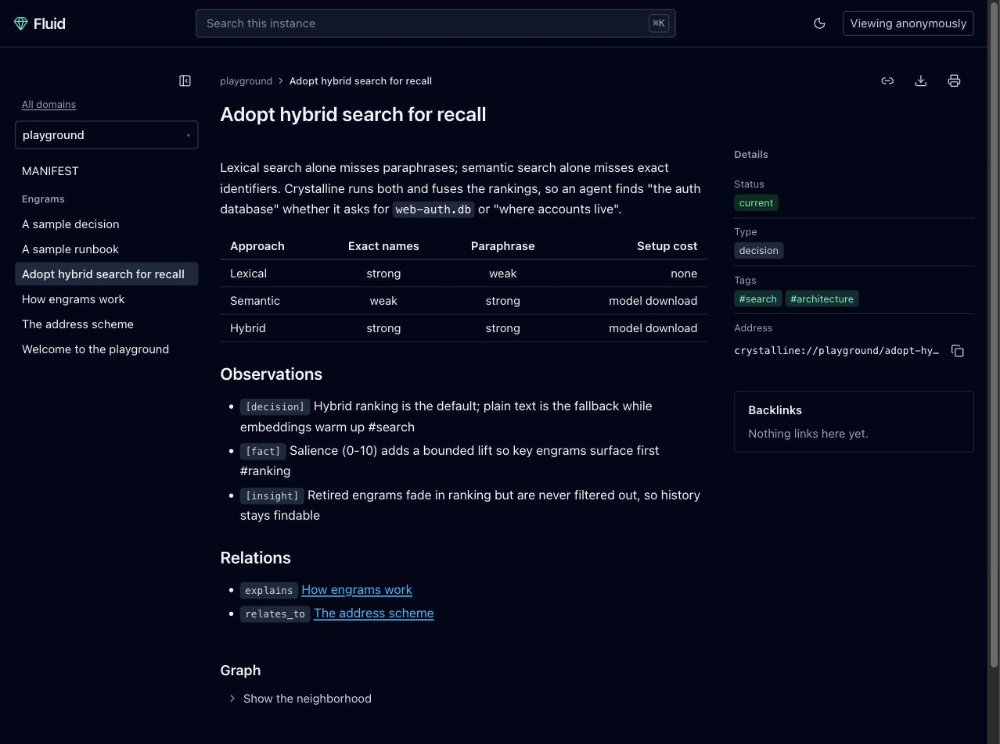

```
                                   ·              *
                                 ▄▄▄▄▄▄▄▄▄▄▄▄▄▄▄▄▄▄▄▄▄
                                ▐░░░▒▒▒▒▓▓▓█▓▓▓▒▒▒▒░░░▌
                                 ▀█░░░▒▒▒▓▓█▓▓▒▒▒░░░█▀   ·
                                   ▀█░░▒▒▒▓█▓▒▒▒░░█▀
                            *        ▀█░▒▒▓█▓▒▒░█▀
                                       ▀█▒▒█▒▒█▀
                                         ▀███▀     ·
                                           ▀

 ██████╗██████╗ ██╗   ██╗███████╗████████╗ █████╗ ██╗     ██╗     ██╗███╗   ██╗███████╗
██╔════╝██╔══██╗╚██╗ ██╔╝██╔════╝╚══██╔══╝██╔══██╗██║     ██║     ██║████╗  ██║██╔════╝
██║     ██████╔╝ ╚████╔╝ ███████╗   ██║   ███████║██║     ██║     ██║██╔██╗ ██║█████╗
██║     ██╔══██╗  ╚██╔╝  ╚════██║   ██║   ██╔══██║██║     ██║     ██║██║╚██╗██║██╔══╝
╚██████╗██║  ██║   ██║   ███████║   ██║   ██║  ██║███████╗███████╗██║██║ ╚████║███████╗
 ╚═════╝╚═╝  ╚═╝   ╚═╝   ╚══════╝   ╚═╝   ╚═╝  ╚═╝╚══════╝╚══════╝╚═╝╚═╝  ╚═══╝╚══════╝
```

[](https://github.com/jordiboehme/crystalline/actions/workflows/ci.yml)
[](LICENSE)
[](https://github.com/jordiboehme/crystalline/releases/latest)
[](https://bundledex.net)

**Crystalline intelligence for AI agents. Plain markdown underneath.**

Psychology splits intelligence in two. Fluid intelligence reasons about novel problems in the moment; crystallized intelligence is everything learning has deposited - the vocabulary, the judgment, the lessons experience already paid for. A large language model is fluid intelligence in its purest form: brilliant in the moment, and the moment is all it has. Every session it starts as a stranger - yesterday's decisions forgotten, the team's conventions unknown, everything re-derived or re-explained.

Crystalline is the other half: the crystalline intelligence an agent accumulates and keeps. Onboarded at session start, taught curated knowledge organized into domains, capturing what it learns as engrams while it works - session by session it stops being a stranger and becomes a peer.

The difference it makes, in one exchange:

```text
Yesterday
  You:    The retry queue silently drops jobs older than 24h. That cost us an hour.
  Agent:  Worth keeping. Captured "Retry queue gotcha" into engineering (#payments #gotcha).

Today, a fresh session
  You:    Why is the payments queue losing jobs again?
  Agent:  Recalled from engineering: the retry queue drops jobs older than 24h,
          captured yesterday. Check the stuck jobs' age before anything else.
```

Crystalline is a single Rust binary: a CLI for people, an MCP server for agents and a local search index on top of plain markdown files.

The name is borrowed from psychology: crystallized intelligence is the knowledge a mind accumulates through experience, the counterpart of fluid, in-the-moment reasoning. Models have the fluid kind in abundance; Crystalline gives them the other half.

[Why Crystalline](#why-crystalline) · [How it works](#how-it-works) · [Get started](#get-started) · [Session onboarding](#session-onboarding) · [The learning loop](#the-learning-loop) · [Teach and learn](#teach-and-learn) · [Skills](#skills) · [Share with a team](#share-knowledge-with-a-team) · [Deployment](#deployment) · [FAQ](#faq)

## Why Crystalline

Crystalline is the evolution of approaches that many teams have walked through in the same order. Giving an agent a single markdown file of instructions works, until it grows past what fits in context. Splitting it into a folder of markdown files works, until nobody can tell which file to read for a given task. Adding index files that point at folders and other files works, until maintaining the pointers becomes its own job and every lookup still means walking a tree by hand. Each step scales further than the last, and each one quietly breaks somewhere in the hundreds of files.

Once knowledge grows into the thousands or tens of thousands of units, reading and pointer-walking stop being viable at all. What is needed at that scale is what any large knowledge system needs: real indexes. Crystalline keeps the plain markdown files - they remain the source of truth, readable and diffable - and adds domain routing, full-text and semantic search, a knowledge graph and temporal filtering on top, so the ten-thousandth engram is exactly as findable as the tenth.

## How it works

- **Domains** are folders of knowledge. Each one carries a `MANIFEST.md` describing its scope and when an agent should route a task there.
- **Engrams** are the unit of knowledge: one markdown file with YAML frontmatter, holding prose, observations (`- [category] a captured fact or lesson`) and relations (`- rel_type [[Other Engram]]`) to other engrams.
- **Built on an open format.** The engram format extends [Google's Open Knowledge Format (OKF) v0.2](https://github.com/GoogleCloudPlatform/knowledge-catalog/tree/main/okf): plain markdown with YAML frontmatter, readable by any OKF tooling, with no lock-in. Unknown keys are always preserved, every engram records who wrote it and when and Crystalline layers its routing, temporal and knowledge-graph conventions on top - so OKF documents drop straight into a domain and your knowledge stays portable, diffable files whatever tools come next.
- **Knowledge retires, it does not disappear.** When a fact stops holding, the old engram is superseded rather than overwritten: its `status` marks it as no longer current, `valid_from`/`valid_to` keep the past addressable by date ("what applied last June") and the lessons it taught carry forward as unbounded knowledge - the way a person still draws on a past job without mistaking it for the present. A retired engram stays in every search; it is only softly faded in ranking, so current knowledge surfaces first without the past ever going missing.
- **MANIFEST routing** lets an agent (or a person) figure out which domain owns a task without reading every file: `crystalline prompt system` turns each domain's `## When to Use` bullets into a compact session-start briefing.
- **Fluid** is the browser UI for an instance, and it is the half of this that is for people: Crystalline stores what was learned, [Fluid](#fluid-the-web-ui) is where you read, edit and think with it.

## Fluid, the web UI

The primary author in Crystalline is the agent: it captures and refines engrams as it works. Fluid is how you take part directly - read what was learned, correct a fact, add knowledge of your own - in the browser, without going through the LLM or spending a token on it. What you write does not sit unreviewed: the agent's next maintenance pass verifies it, aligns the tags and wires it into the graph. Fluid is built into the binary and on by default at `http://localhost:7411`, so the daemon your agents already talk to serves people and agents on one port: nothing to deploy, and the first visit creates your admin account right in the browser.



- **Read what was learned.** An engram is a page: frontmatter as a details rail, observations and relations as labelled chips, backlinks, and the `crystalline://` address one click from the clipboard. Domains down the side, Cmd+K to jump anywhere by name.
- **Edit in place.** A live-preview markdown editor with table editing, a frontmatter form, mermaid previews and wikilink completion across every domain. The file on disk stays the source of truth.
- **Attach what you teach with.** Paste, drag or upload a screenshot, a diagram, a slide deck, a PDF or a data file straight onto an engram; agents read those attachments back over MCP and evolve keeps the knowledge extracted from them current. An attachment always belongs to some engram's teaching, and a file nothing references is flagged for cleanup rather than left to accumulate. Image references take an optional formatting fragment - a single `#` carrying comma-separated options, `left`, `right`, `center`, `full` and `w=50%` or `w=320`, as in `` - that Fluid honors and every other markdown renderer simply ignores.
- **Collaborate in real time.** Everyone in the same engram sees everyone else's cursors and edits live; changes merge conflict-free and land as one save.
- **Search it all.** Faceted search across the whole instance, backed by the same hybrid text-plus-semantic ranking the agents use.
- **See what the knowledge needs next.** A maintenance page with the ranked queue of everything due - stale dates, half-finished retirements, unreviewed human captures - the same queue the agent works.
- **See the shape of it.** An interactive graph of any engram's neighborhood, and an agent's-eye view showing exactly what the tools serve an agent for that page.
- **Accounts when you need them, none when you don't.** Admin, editor and viewer roles managed in the UI or with `crystalline users`; an anonymous read-only mode for a published archive; a trusted-header mode behind an SSO proxy. See [deployment](docs/deployment.md) for the container and team-server variants.

## Get started

Sixty seconds on a Mac with [Homebrew](https://brew.sh) and Claude Code:

```sh
brew install jordiboehme/tap/crystalline
crystalline install claude-code
mkdir -p ~/knowledge/engineering
crystalline domain init ~/knowledge/engineering --name engineering
crystalline domain add engineering ~/knowledge/engineering
```

Start a session - the agent onboards itself and starts remembering. Then open `http://localhost:7411`: the daemon that session started serves the web UI there by default, and the first visit creates your admin account in the browser, so there is nothing to deploy and nothing to configure to read what your agent is learning. Everything below is the same three steps on other platforms and harnesses: install the binary, wire the harness, give the agent a domain. Claude Desktop skips the binary entirely - jump straight to [its subsection](#claude-desktop). Semantic search wants the local embedding model fetched once with `crystalline model download`; plain text search works before that.

### Install the binary

macOS, via [Homebrew](https://brew.sh):

```sh
brew install jordiboehme/tap/crystalline
```

Linux, via `.deb` package (Debian, Ubuntu and derivatives, amd64 or arm64):

```sh
version=$(curl -fsSL https://api.github.com/repos/jordiboehme/crystalline/releases/latest | grep -m1 '"tag_name"' | cut -d '"' -f4)
arch=amd64   # or arm64
curl -fsSLO "https://github.com/jordiboehme/crystalline/releases/download/${version}/crystalline_${version#v}_${arch}.deb"
sudo dpkg -i "crystalline_${version#v}_${arch}.deb"
crystalline --version
```

The package also ships a systemd unit, installed disabled - see [Linux server with systemd](docs/deployment.md#linux-server-with-systemd) to run the daemon as a managed service.

Windows, via MSI: download `crystalline-<version>-windows-amd64.msi` (or `crystalline-<version>-windows-arm64.msi` for Arm devices) from the [latest release](https://github.com/jordiboehme/crystalline/releases/latest) and double-click it, or install silently with `msiexec /i <file> /qn`. The installer adds Crystalline to the system PATH and upgrades in place. Windows releases are not code signed yet, so verify against `SHA256SUMS` and confirm any SmartScreen prompt (More info > Run anyway).

Every [release](https://github.com/jordiboehme/crystalline/releases/latest) also ships the standalone `crystalline` binary for macOS (Apple Silicon and Intel), Linux (x86_64 and arm64, statically linked) and Windows (x64 and Arm64), with a `SHA256SUMS` file for verification - or build from a clone with `cargo build --release`. The macOS binaries are code signed and notarized with an Apple Developer ID, so Gatekeeper runs them without a prompt.

### Claude Code

```sh
crystalline install claude-code
```

One command wires the whole integration: MCP registration, the `SessionStart` onboarding hook, the `Stop` capture nudge (see [The learning loop](#the-learning-loop)) and the four topical skills. It is idempotent - rerun it any time and whatever is already correct is left untouched - and each part is skippable with `--skip-mcp`, `--skip-hooks` or `--skip-skills`; `--project` writes into the current repository's config instead of your global one, and `crystalline uninstall claude-code` reverses everything `install` did, leaving any hook, key or locally edited skill that is not Crystalline's own in place.

The quick start above is exactly this path end to end; give the agent its first domain the same way and start a session.

### Claude Desktop

No terminal needed:

1. Download `crystalline-v<version>.mcpb` from the [latest release](https://github.com/jordiboehme/crystalline/releases/latest) - one universal bundle covering Apple Silicon Macs and Windows (per-arch bundles remain for Intel Macs and native windows-arm64).
2. In Claude Desktop, open Settings > Extensions > Advanced settings > Install Extension... and pick the file.

It starts with no domains: the agent creates one with the `add_domain` tool whenever it needs somewhere to capture knowledge - a folder of markdown files under your `Documents/Crystalline` folder, a database-backed domain or a GitHub team domain. Onboarding is automatic on every connection (see [Session onboarding](#session-onboarding)). The extension gets you the browser half too: the daemon it spawns serves the web UI at `http://localhost:7411` by default, where the first visit creates your admin account. The optional companion skill adds capture and collaboration best practices (see [Skills](#skills)); the [Claude Desktop extension scenario](docs/deployment.md#claude-desktop-extension) shows how it works underneath.

### Codex CLI

The same integration, one command (Codex keeps MCP registration user-level even with `--project`; the installer says so when it applies):

```sh
crystalline install codex
```

Then give the agent its first domain as in the quick start.

### GitHub Copilot CLI

The same integration for the agentic Copilot CLI, one command (Copilot too keeps MCP registration user-level even with `--project`). The installer drives the `copilot` binary and falls back to `gh copilot` when only the GitHub CLI form is installed:

```sh
crystalline install copilot
```

Hooks land in a dedicated `~/.copilot/hooks/crystalline.json` and skills in `~/.copilot/skills` (both honor `COPILOT_HOME`); with `--project` they go to `.github/hooks` and `.github/skills` instead, which Copilot loads once you trust the folder. Then give the agent its first domain as in the quick start.

### Any MCP harness

Crystalline runs as an MCP server over stdio; the server command is always `crystalline mcp`. Everything the installer does can also be done by hand:

```sh
claude mcp add crystalline --scope user -- crystalline mcp --harness claude-code
codex mcp add crystalline -- crystalline mcp --harness codex
copilot mcp add crystalline -- crystalline mcp --harness copilot
```

`--harness` is optional and tells the server which harness spawned it, so a harness that already has the skills installed as files is not served them a second time over MCP (see [Skills over MCP](#skills-over-mcp)). Leave it out and the full surface is served. The `--` matters on the Claude Code line: without it, `claude mcp add` reads the server's own flags as its options.

The first agent to connect starts a background daemon that loads the embedding model once and watches every registered domain; every later connection - other agents, other terminals, other harnesses - attaches to that same daemon, so there is always one shared instance and one consistent view of the index. A daemon running in a container is reached over HTTP instead of stdio - see [Run in a container](docs/deployment.md#run-in-a-container).

### From the terminal

The CLI mirrors everything an agent can do. This runs verbatim, start to finish, on a clean machine:

```sh
# 1. Create a domain: a folder of knowledge with a MANIFEST.md at its root.
#    domain add indexes whatever is already there (the manifest, for now)
#    right away, no separate sync step needed.
mkdir -p ~/knowledge/engineering
crystalline domain init ~/knowledge/engineering --name engineering
crystalline domain add engineering ~/knowledge/engineering

# 2. Capture an engram: a unit of knowledge, with an observation bullet.
crystalline write engineering "Retry queue gotcha" \
  --content "- [gotcha] The retry queue drops jobs older than 24h #payments" \
  --tags gotcha,payments

# 3. Search it back (plain text, since no embeddings exist yet).
crystalline search "retry queue"

# 4. Fetch the local embedding model once, then re-sync with embeddings.
crystalline model download
crystalline sync --embed

# 5. Search again: hybrid text-plus-semantic ranking now finds the engram
#    from a differently worded description of the same problem.
crystalline search "why does the payments queue lose jobs"

# 6. See what got indexed.
crystalline status
```

Engrams written through Crystalline are indexed immediately; `crystalline sync` only picks up files created outside it (an editor, a `git pull`) when no daemon is watching them. Edit the domain's `MANIFEST.md` `## Scope` and `## When to Use` sections so routing describes it accurately - that file is what the session prompt and an agent's routing decisions read (see [Session onboarding](#session-onboarding)).

[The Crystalline Playbook](docs/playbook.md) teaches the whole workflow by example, a use-case course over one running dataset through recording, querying, ingesting, reconciling, retiring and sharing knowledge.

## Session onboarding

Every MCP client is onboarded automatically: the crystalline server's instructions, returned when a client connects, carry a live routing block - one line per registered domain summarizing when to use it, plus the behavior rules (narrow question -> search that domain; broad question -> sweep all of them; writes always name a domain explicitly). The block names the exact crystalline tools each rule refers to (`search_engrams`, `write_engram` and the rest), so an agent with several MCP servers connected knows which tool on which server to call.

Domain lists and file-domain MANIFESTs are read fresh for every new connection; virtual-domain routing lines follow the daemon's latest snapshot, refreshed on every stdio connection and on every local virtual write. Claude Desktop and any harness that shows the model its MCP server instructions need no further setup. A harness installed on this machine with `crystalline install` is the one exception, and it needs no setup either: its own session hook delivers the block, so the server recognizes it at connect time and hands it a one-line pointer instead of a second copy (see [Skills over MCP](#skills-over-mcp)).

The block is sized for clients that truncate server instructions: the intro and the behavior rules come first and always fit, and the domain lines that follow shrink to one bullet each, then to a single count line, rather than pushing the rules out of view. Nothing is lost either way, since `list_domains` with `include_routing=true` returns the whole index on demand.

The same routing block is available outside MCP: `crystalline prompt system` renders it to stdout from every registered domain's `MANIFEST.md`, to feed to an agent as session context. Over MCP there is no workspace, so `prompt.rules` filters and repo-local `preferred_domains` apply only on this path - `crystalline prompt system --workspace .` scopes it to the current repository. `prompt` takes a subcommand naming the kind of prompt to generate: `system` for hook-driven harnesses, `connector` for the snippet below.

The generic harness recipe: run `crystalline prompt system` at session start and inject its stdout as context before the agent does anything else. In Claude Code that is a `SessionStart` hook in `settings.json`, matched on `startup|clear|compact` so the routing block is re-injected after `/clear` and after a compaction as well as on a fresh start (a resumed session is deliberately excluded, since its transcript already carries the earlier routing block). [Get started](#get-started) covers `crystalline install`, which writes this hook for you; by hand it is:

```json
{
  "hooks": {
    "SessionStart": [
      {
        "matcher": "startup|clear|compact",
        "hooks": [
          { "type": "command", "command": "crystalline prompt system" }
        ]
      }
    ]
  }
}
```

Any harness with an equivalent session-start hook can run the same command the same way.

### Remote clients

A remote service or a chat harness runs no session hooks, and most of them never show the model an MCP server's instructions, so neither onboarding path above reaches the agent. Give it a standing instruction instead: paste this into the client's custom instructions and the agent onboards itself with one tool call at the start of every session.

```text
This environment includes Crystalline, your crystallized intelligence across sessions, over MCP. At the start of every session call its list_domains tool with include_routing set to true; the result is your onboarding: one routing line per domain plus the behavior rules for this server's tools. Follow it, search those domains before answering from memory and re-fetch it mid-session with the same call whenever you need it again.
```

`crystalline prompt connector` prints the same snippet, ready to copy. The same text is also available in-client, with no copy-paste, as the `connector` MCP prompt; a harness that shows the model MCP prompts can insert the `onboarding` prompt directly instead, which carries the live routing block itself rather than the instruction to fetch it (see [Skills over MCP](#skills-over-mcp)).

An agent built on the Messages API MCP connector can keep its context lean by deferring most of the tool surface: with `defer_loading` on, a tool is declared but its description and schema load only when the model searches for it. Defer everything by default and pin the three tools an agent needs before it can search for anything - `search_engrams`, `read_engram` and `list_domains`, the trio that carries session onboarding and recall:

```json
{
  "mcp_toolset": {
    "type": "mcp_toolset",
    "mcp_server_name": "crystalline",
    "default_config": { "defer_loading": true },
    "configs": {
      "search_engrams": { "defer_loading": false },
      "read_engram": { "defer_loading": false },
      "list_domains": { "defer_loading": false }
    }
  }
}
```

Claude Code does this for you: it turns tool search on automatically once a session's MCP tool descriptions grow large, loading tool names plus each server's instructions up front and the rest on demand. The routing block is sized to survive that mode intact (see [Session onboarding](#session-onboarding)).

## The learning loop

Experience only compounds when capture actually happens. The loop has three beats: the agent recalls what is known at session start, works with it and captures what it learned before the session ends. The last beat is the one agents skip when nothing reminds them - so `crystalline install` wires the reminder.

It is a `Stop` hook running `crystalline hook stop`: a once-per-session, late nudge that fires on the first stop after a session gains real substance and stays silent otherwise - below the substance threshold, once it has already fired, in read-only mode or with no domain registered. When it fires, it asks the agent to review the conversation for durable learnings, propose capturing each one into the fitting domain (the same propose-first, wait-for-a-yes shape the capture skill follows) and raise the salience of any recalled engram that proved key to the task.

The reminder costs about 120 tokens, at most once per session. Remove it with `crystalline uninstall <harness>`, or leave it out from the start with `--skip-hooks`.

## Teach and learn

The MCP server exposes 17 tools, 21 once team domains are turned on (see [Share knowledge with a team](#share-knowledge-with-a-team)); capturing knowledge as a byproduct of work is the core loop:

- **`write_engram`** - capture a new engram. `domain` is always required (there is no default domain for writes, so an agent never writes into the wrong place). `permalink`, `status` and `recorded_at` are filled in for you.
- **`search_engrams`** - search before writing, and search to recall what is already known. Defaults to hybrid text-plus-semantic ranking across every domain; pass `domains` to narrow it, or filter by `type`, `tags`, `status` or arbitrary `metadata_filters` with no query text at all.
- **`edit_engram`** - refine an engram in place (`append`, `prepend`, `find_replace`, `replace_section`, `insert_before_section`, `insert_after_section`, `set_frontmatter`) instead of creating a duplicate for the same topic. `set_frontmatter` assigns one lifecycle field by name - `status`, `valid_from`, `valid_to`, `stale_after`, `source_date`, `salience` or `verified` - so retiring an engram or recording a re-check is a field assignment rather than a text substitution.
- **`build_context`** - given a `crystalline://domain/permalink` anchor, follow its relations and links (across domains too) to assemble the neighbourhood around a task before diving in - the neighbourhood comes back ranked by how strongly each engram connects to the anchor, salience-aware, so `max_related` keeps the most relevant.
- **`vocabulary`** - list the tags, observation categories and relation types already in use, with counts, and reuse an existing term before coining a near-duplicate.
- **`evolve_engrams`** - ask what the archive needs instead of waiting to trip over it: a read-only sweep of one domain or all of them that returns a ranked maintenance queue, every finding carrying the evidence it fired on and the exact next action. It sees temporal and lifecycle debt (a `valid_to` that elapsed while the status still reads current, a `stale_after` past due, a replacement that landed while the retirement was never finished), structural gaps (unresolved `[[links]]`, one-sided relation pairs, orphans, oversized engrams and stubs) and redundancy (near-duplicate clusters, drifted tags). A finding marked `mechanical` completes intent the archive already records; one marked `judgment` changes what the archive claims and wants a yes first. It is the tool behind `crystalline evolve` below.

Attachments run the same loop in the other direction: files enter through Fluid (or a domain archive), never through an agent write, and reach an agent as resource links on `read_engram` that `resources/read` fetches by URI - so the slide deck a person drops onto an engram is something the next session reads and learns from rather than an opaque blob, and `evolve_engrams` raises a finding whenever a fresh or changed file still needs capturing.

Observations are the atomic unit of an engram's body: top-level bullets like `- [decision] we chose Postgres for the write path #database`. Categories are free text; useful ones include `decision`, `fact`, `pattern`, `gotcha`, `convention`, `lesson`, `risk` and `idea`. Relations connect engrams: `- depends_on [[Other Engram]]`, or `- "relates to" [[Other Engram]]` for a multi-word relation type.

Temporal fields are plain and easy to get wrong by overthinking them: an absent `valid_from` means the engram has always been valid, an absent `valid_to` means it is valid forever. When set, the fields are plain ISO dates (YYYY-MM-DD) at day granularity, and the write drops a sentinel far-future value outright, since absence already means forever. Set them only when a fact is genuinely time-bounded (a policy that changes on a known date, a temporary workaround). `status` and `type` have recommended value sets stated in the tool descriptions themselves (status: `stable`, `draft`, `idea`, `deprecated`, `superseded`, and so on; type: `engram`, `guide`, `decision`, `architecture`, `runbook`, `reference`) - they exist so an agent can tell an idea apart from current fact, and they are guidance, never a global enum a write is rejected for.

Exceptionally valuable knowledge can carry a numeric `salience` key (0 to 10) in `metadata`, the way a memory formed during an exceptional event encodes more strongly: hybrid search adds a small bounded lift for it, so a salient engram ranks above equally relevant unmarked ones while relevance keeps the upper hand and nothing is ever filtered out by it. An agent raises it later on an engram that proved to be the key to a task; the lift's strength is the `search.salience_weight` setting (0.0 to 1.0, default 0.15, 0 disables it). The counterpart on the way out is `search.retired_weight` (0.0 to 1.0, default 0.6, 1.0 disables it): an engram whose `status` is `deprecated`, `superseded`, `archived` or `legacy` is softly faded by it in ranking, never filtered out.

The CLI mirrors the mutating and read tools directly for scripting and quick edits outside an agent session: `crystalline write`, `read`, `edit`, `move`, `delete`, `search`, `context`, `recent` and `vocabulary` take the same parameters as their MCP counterparts.

Tag identity is case-folded, so `Foo` and `foo` are the same tag; the files keep whatever case you wrote. For the rest of tag drift - a separator swap or a plural - `crystalline vocabulary` and `crystalline doctor` surface near-duplicate clusters, and two CLI-only commands consolidate them: `crystalline tags rename <old> <new>` and `crystalline tags merge <old> <into>`. Both rewrite only the tag tokens, preview before writing and take `--dry-run`, `--yes` and `--domain`; a merge also records the fold in the MANIFEST's `## Tag Aliases` section, so a search for the old name keeps resolving forever. Bulk rewrites are deliberate maintenance, which is why these live on the CLI rather than as MCP tools.

## Skills

The `skills/` folder ships four harness-agnostic agent skills plus one consolidated skill, teaching an agent how to use Crystalline well:

- **`crystalline-routing`** - which domain(s) to search for a task, when to sweep every domain instead, temporal filtering for "what is true now", and when to fall back to reading a MANIFEST directly.
- **`crystalline-capture`** - when captured knowledge is worth writing down, searching before writing to avoid duplicates, editing an existing engram instead of forking the topic, and the observation-category and temporal-field conventions that keep engrams useful later.
- **`crystalline-schema`** - authoring a Picoschema schema engram for a domain that wants structure, inferring one from what is already captured, and validating conformance.
- **`crystalline-collaboration`** - working in a domain that has a team origin: checking status at session start, updating before deep work, sharing a coherent unit of knowledge as a proposal and relaying its review URL, conflict etiquette and connecting a new teammate end to end.
- **`crystalline-intelligence`** - a single consolidated skill for Claude Desktop and other harnesses that install one skill at a time: recall, capture, read-only stand-down and team sharing essentials in one file.

`crystalline install claude-code` (or `codex` or `copilot`) copies these same four skills into place automatically - `~/.claude/skills` for Claude Code, `~/.agents/skills` for Codex, `~/.copilot/skills` for the Copilot CLI - and leaves `crystalline-intelligence` alone, since it is Claude Desktop's own consolidated skill. Each is a plain folder with a `SKILL.md`; to do it by hand instead, copy the folder into wherever your harness looks for skills. For Claude Code, that is `.claude/skills/` in a project or `~/.claude/skills/` globally:

```sh
cp -r skills/crystalline-routing skills/crystalline-capture skills/crystalline-schema skills/crystalline-collaboration ~/.claude/skills/
```

Installed skills stay current on their own: each install is recorded in a local receipt and when a new crystalline version first runs it refreshes the installed skills at session start - updating changed ones (an edited copy is kept beside the new one as `SKILL.md.bak`) and removing ones the new version no longer ships.

Installing from a release instead of a clone: download `crystalline-agent-skills-v<version>.zip` from the [latest release](https://github.com/jordiboehme/crystalline/releases/latest) and unpack it into `~/.claude/skills/`. Zip installs are not tracked by the receipt, so re-unpack the zip after upgrading crystalline (or run `crystalline install` once to switch to managed skills).

Claude Desktop: download `crystalline-claude-desktop-skill-v<version>.zip` from the latest release, then open Settings > Capabilities > Skills (enable the Skills capability there if it is off) and upload the zip as-is (it contains the `crystalline-intelligence` folder; do not unpack it). If you uploaded an earlier release's skill, delete the old `crystalline-memory` entry there once the new one is up - Desktop keeps uploaded skills side by side, and the two teach the same lessons twice. Routing itself needs no skill - the server's instructions deliver it automatically; the skill adds capture and collaboration best practices.

Other harnesses that support a similar skill or instruction-file convention can point at the same folders directly; the content only assumes the MCP tools documented in [Teach and learn](#teach-and-learn), never a specific harness.

### Skills over MCP

Installing the folders is not the only way in: every server also serves the same five skills to remote clients that never run the CLI at all. A chat surface calls the `skills` tool - with no arguments it lists all five, by name it returns one skill's full `SKILL.md`. A harness whose agents read MCP resources instead reaches the same content at `skill://<name>/SKILL.md`. And a harness that shows the model MCP prompts can insert the `onboarding` or `connector` prompt directly, the same text described in [Remote clients](#remote-clients) below. All three are governed by the one `skills.serve` setting. Its default, `auto`, serves them to every client except a session spawned by a harness this machine has already onboarded: `crystalline install` registers the MCP server as `crystalline mcp --harness <name>`, and a session started that way asks the local install receipt whether that harness has its session hooks wired. If it has, it already carries the five skills as files and gets its routing block from its own hook, so it is served neither the skill surface nor a second copy of the onboarding block. Everything else is served in full, including a registration made before that flag existed, a harness the receipt does not know and every HTTP client - a remote client never ran the CLI here, so nothing on this machine says what it has.

`claude mcp get crystalline` (and the Codex and Copilot equivalents) shows whether a registration carries the flag, which is how to tell which answer a stdio session will get. Set `skills.serve` to `true` to serve everything to everyone regardless, or to `false` to serve the skills to nobody, for an operator who would rather ship them only as zips; either explicit value overrides the resolved answer and makes every client identical, on both transports. The value is read once when the daemon starts, so changing it with `configure` applies from the next start.

After upgrading from a version before this flag existed, an existing registration still reads plain `crystalline mcp` and the skill surface simply stays on, exactly as it was. To pick the flag up:

- **Claude Code:** rerun `crystalline install claude-code`. It reads the existing entry back and re-registers it in place. It only does that for an entry it recognizes as its own, in the scope it would write, carrying no environment block of yours; anything else it leaves untouched and prints the command you can run yourself.
- **Codex and Copilot:** rerun `crystalline install` does *not* repair those, because their `mcp get` output format has not been verified and an install that cannot read what it is repairing must not touch it. Replace the entry yourself: `codex mcp remove crystalline && codex mcp add crystalline -- crystalline mcp --harness codex`, and the same shape for `copilot`.

Either way this is an optimisation, not a fix: leaving it alone costs a duplicated routing block and six listed entries, nothing more. Setting `skills.serve` explicitly to `true` or `false` sidesteps it entirely.

## Ship tools with a domain

Teaching an agent what a domain knows is half the story - the other half is the working tools that knowledge depends on to act on it: skills, slash commands, subagent definitions and MCP server configs. A domain's `MANIFEST.md` can declare a `## Provisioning` section naming the folders it ships, one bullet per kind:

```
## Provisioning

- skills: skills
- commands: commands
- agents: agents
- mcps: mcps
```

Each bullet is `type: path`, one of `skills`, `commands`, `agents` or `mcps` (a folder of JSON configs for `mcps`); `path` is relative to the MANIFEST itself and may climb out of the domain root with `../` to point at a folder that lives beside it. The starter MANIFEST `crystalline domain init` scaffolds does not include this section - add it by hand once a domain actually ships something. Every artifact is authored once and translated into whichever harnesses' formats allow it, a markdown agent becoming Codex's TOML dialect and back again.

Nothing ships until a person decides to: an undecided domain surfaces at session start so the agent can raise it with the person at the keyboard, then applies the answer with the `provision` MCP tool or from the terminal:

```sh
crystalline provision allow engineering   # opt in, then reconcile
crystalline provision deny engineering    # opt out, removing anything already shipped
crystalline provision status              # every domain's decision, every harness's installed state
```

Bare `crystalline provision` reconciles every opted-in domain into every harness this machine has onboarded. It is idempotent and safe to rerun - installing what is missing, updating what changed and retiring what a domain no longer ships. A provisioned file you edited by hand is still brought current on the next reconcile, with your edited version kept beside it as a `.bak` copy rather than lost; a foreign file Crystalline never wrote is adopted when it already matches byte for byte and otherwise left untouched, never overwritten.

## Share knowledge with a team

A team domain is an ordinary domain whose files also live in a GitHub repository: local markdown stays the source of truth on this machine, and an origin records which repository, subfolder and branch it tracks.

Connect this machine to GitHub once:

```sh
crystalline config set github.enabled true
crystalline connect github
```

`connect github` opens a short code to confirm at github.com/login/device, or takes a personal access token via `--token` for someone who would rather skip the browser; either way there is no git and no SSH key involved, since connecting only establishes this machine's GitHub identity. An agent does the same through the `configure` MCP tool, passing `connect: "github"` and relaying the code to the person at the keyboard.

Bring a team repository in as a domain:

```sh
crystalline domain add design --origin acme/design-knowledge --branch main
```

`--origin` takes `owner/repo` or `owner/repo/subpath` when the domain is a subfolder of a bigger repository; the local folder defaults to `<domains_root>/<name>` (the domains root is `~/Documents/Crystalline` unless you set `domains_root` or `CRYSTALLINE_DOMAINS_ROOT`) and the domain is downloaded and indexed immediately. An agent does the same with the `add_domain` MCP tool.

From there, `crystalline origin` covers the team domain lifecycle:

- **`origin status [--domain <name>]`** - where a team domain stands: ahead, behind, open and declined proposals, unresolved conflicts.
- **`origin update [--domain <name>]`** - bring a team domain (or every one) up to date with what the team has merged.
- **`origin share <name> [--title <t>] [--message <m>]`** - share local changes as a proposal the team reviews on GitHub; refuses while a conflict is unresolved so the team always reviews a clean proposal.
- **`origin resolve <name> <path> --keep mine|theirs`** (or `--content-file <f>` for a hand-merged result) - settle a flagged conflict.
- **`origin discard <name> --proposal <n>`** - abandon a declined or no-longer-wanted proposal, restoring local files that were not touched since sharing them.

The same actions are MCP tools an agent calls directly: `update_domain`, `origin_status`, `share_changes` and `resolve_conflict`, plus `configure` for settings and connecting. These four need `github.enabled` turned on: an install that never uses team domains still sees them listed, and calling one there answers with the reason and the `configure` call that turns collaboration on. They are listed either way because a server's tool list has to be the same for every client that connects to it, so a setting a client can change mid-session gates the call rather than the listing. `add_domain` is not among them: it creates domains of every kind (local, virtual, team) and is always available, though its team-domain branch still needs `github.enabled`. Sharing always ends with the agent relaying the proposal's review URL to the person it is working with, since review and merging happen on GitHub, by a person, never by the agent.

`crystalline config show`, `set <key> <value>` and `unset <key>` read and write the same settings registry the `configure` MCP tool exposes, today `domains_root` plus the `github.*`, `service.*`, `skills.*`, `database.*` and `search.*` blocks. Every settings key also maps to a `CRYSTALLINE_*` environment variable, so a container never needs to mount this file at all - see [Configure through environment variables](docs/deployment.md#configure-through-environment-variables) for the full list. A domain's origin and the global `github` block look like this in `config.yaml`:

```yaml
domains:
  design:
    path: ~/Documents/Crystalline/design
    origin:
      repo: acme/design-knowledge   # the GitHub repository, owner/name
      path: knowledge               # optional subfolder; absent means the repository root
      branch: main                  # optional; absent means main
      poll_secs: 600                # optional per-domain poll interval override
github:
  enabled: true                     # turns team domains on; absent means off
  poll_secs: 300                    # background poll interval in seconds; minimum 60
  api_url: https://github.example.com/api/v3   # GitHub Enterprise Server only
  oauth_client_id: abc123                       # a self-hosted OAuth App, GitHub Enterprise Server only
```

## Keep knowledge honest

`crystalline verify` statically checks one or more domains against the full rule catalog - malformed frontmatter, broken links, missing MANIFEST sections, schema drift - with no database, service or network connection involved. Its usual home is CI/CD on the GitHub repositories that hold a team's knowledge: every proposal is verified before the team merges it, so nothing malformed ever lands on the branch everyone pulls from. The bundled GitHub Action wires that up:

```yaml
- uses: jordiboehme/crystalline/action@v0.15.0
  with:
    paths: knowledge/       # space-separated domain roots, default '.'
    strict: 'false'         # promote Warning rules to Error
    version: v0.15.0        # crystalline binary tag to download, or 'latest'
```

The action ref (`@v0.15.0`) pins the action's own code; `version` pins the crystalline binary it downloads, so pinning both gives a fully reproducible check. The binary is checksum-verified, then the action runs `crystalline verify`, annotates the run and, on a pull request, posts a single summary comment kept up to date in place.

Verify is one of three checks, and each asks a different question. `crystalline verify` asks whether the format holds. `crystalline doctor` asks whether the machinery around it - the index, the registered domains, the service - is healthy. `crystalline evolve` asks the question neither of the other two can: is the knowledge itself still true, and is it still well organized? A fourth command, the importer, brings an existing knowledge base under Crystalline in the first place:

- **`crystalline evolve`** sweeps one domain or every domain for the maintenance the knowledge needs and prints a ranked queue, each finding naming the engram, the evidence it fired on and the exact next action. It sees temporal and lifecycle debt (a `valid_to` that elapsed while the status still reads current, a `stale_after` past due, long-unverified knowledge, a retirement whose replacement landed but whose old engram was never flipped), structural gaps (unresolved `[[links]]`, one-sided relation pairs, orphans, oversized engrams and stubs) and redundancy (near-duplicate clusters, drifted tags). Narrow it with `--domain`, `--family`, `--rule` or `--min-priority`, and pass `--today` to evaluate the temporal rules as of a fixed date so a run reproduces. It is read-only and detects by dates, links and graph shape, never by meaning, so it hands over work to do rather than rewriting knowledge on its own - the same sweep the `evolve_engrams` tool gives an agent.
- **`crystalline doctor`** diagnoses the index, registered domains and service state (orphan index rows, encoding issues, stale service locks) and repairs what it safely can with `--fix`. Once team domains are turned on it also reports whether this machine is connected to GitHub and whether each team domain's local origin state is intact. When a domain ships provisioned artifacts, it reports every declaring domain's decision and shipped counts and every installed harness's drift, locally edited and orphaned counts against what was last reconciled - that part, like the GitHub checks, is always report-only, `--fix` never reconciles a harness.
- **`crystalline import <src> --domain <name>`** brings an existing markdown-plus-frontmatter knowledge base under Crystalline: normalizes legacy `type` values, backfills `status` and temporal metadata, drops sentinel far-future dates in favor of leaving the field open-ended, and records write provenance where a file carries none - all as a pure file transformation, with `--dry-run` to preview first.

### Browse a domain without Crystalline

Every folder of a file domain carries a generated `index.md`: a plain markdown listing of the engrams in that folder (title plus description, linked relatively) and of the subfolders below it. It is written after every write, edit, move, delete and sync, so a domain browsed in an editor, on a git forge or by any other tool navigates itself, with nothing running. The listing at the domain root additionally declares the knowledge format version with `okf_version: "0.2"`.

`index.md` and `log.md` are reserved filenames: Crystalline never indexes them, never searches them, never verifies them and refuses to file an engram under either name. The log is reserved only, never generated. Turn the generated listings off with `crystalline config set index.files false`; existing files stay where they are and stay out of the index.

## Deployment

Crystalline runs the same way in every scenario: a daemon in the middle keeps one search index in sync with knowledge, and one or more agents connect to it, whether over a local stdio pipe or a network HTTP endpoint. [docs/deployment.md](docs/deployment.md) walks through every shape with one diagram per scenario, plus running the container image, configuring through environment variables and read-only serving.

| Scenario | In one line |
|---|---|
| [Personal workstation](docs/deployment.md#personal-workstation) | The default: local folders, agents over stdio, one shared background daemon |
| [Claude Desktop extension](docs/deployment.md#claude-desktop-extension) | One-click `.mcpb` install, no terminal involved; the agent creates domains at runtime |
| [Team server](docs/deployment.md#team-server) | One container on the network, every agent connects over HTTP |
| [Web UI from the daemon](docs/deployment.md#web-ui-from-the-daemon) | The browser UI ships built into the binary, on by default at localhost - browse what your agents know with zero extra moving parts |
| [Team server with Fluid](docs/deployment.md#team-server-with-fluid) | The scale-out variant: nginx replicas in front when one daemon port is not enough |
| [Linux server with systemd](docs/deployment.md#linux-server-with-systemd) | The .deb ships a unit, disabled by default; enable it once and agents connect over HTTP |
| [Published read-only domains](docs/deployment.md#published-read-only-domains) | Knowledge curated in a git repository, served read-only to agents |
| [Air-gapped or egress-restricted](docs/deployment.md#air-gapped-or-egress-restricted) | The `with-model` image or a pre-fetched model directory; nothing at runtime needs the network |
| [Shared database collaboration](docs/deployment.md#shared-database-collaboration) | Several instances share one PostgreSQL index, so every capture is visible to all |
| [Team knowledge on GitHub](docs/deployment.md#team-knowledge-on-github) | A domain tracks a GitHub repository; sharing goes through reviewed proposals |

## Virtual domains

Most domains are folders of files. A virtual domain is the other option: its engrams live in the database, with no filesystem root. Reach for one where a filesystem is baggage rather than a feature - a container with no writable volume, a PostgreSQL backend shared across machines, or a domain you would rather not mirror to disk at all.

```sh
# Register a database-backed domain and scaffold its MANIFEST into the index.
crystalline domain add decisions --virtual

# It works with the same tools as any domain.
crystalline write decisions "First decision" --content "captured straight into the database"
crystalline search "captured"
```

Two commands move engrams between the two kinds of truth:

- `crystalline domain import <path> --domain <name>` loads already-well-formed engram files into a virtual domain, verbatim. It is distinct from `crystalline import`, which converts a legacy tree into a *file* domain's directory.
- `crystalline domain export <path> --domain <name>` writes any domain's engrams back out as a normal markdown folder. This is how you take a virtual domain's data out to run `crystalline verify` on it, or convert it back to files whenever you change your mind.

Concurrent edits to the same virtual engram are guarded: `read_engram` returns a checksum, and passing it back as `expected_checksum` on `edit_engram` refuses the edit if the engram changed since you read it, so a stale write conflicts instead of clobbering. Omit it for last-write-wins.

## Architecture

```
crystalline-core     format layer: parser, emitter, Picoschema, verify, prompt
       |              (no async runtime, no database, no ML - stays static)
       v
crystalline-index    Store trait, embedded database, sync engine, search, embeddings
       |
       v
crystalline-service  single-instance daemon, MCP tool router, control protocol
       |
       v
crystalline (cli)    the one user-facing binary
```

Exactly one process ever holds the database open: the first `crystalline mcp` or `crystalline serve` takes an advisory lock and becomes the daemon; every later CLI command or MCP connection attaches to it over a local socket, or opens the database directly for a brief operation when no daemon is running.

One principle runs through the whole stack: every domain has exactly one source of truth - markdown files on disk by default, the database itself for a [virtual domain](#virtual-domains) - and the search index is always a derived, disposable layer. `crystalline reindex --full` rebuilds it from the files at any time, so index corruption or a schema change is never a data-loss event.

## FAQ

**Why not just a folder of markdown files?**

It is one - that is the point. Your knowledge stays plain markdown you can read, diff and back up with anything. Crystalline adds what a folder cannot: domain routing, hybrid text-plus-semantic search, a knowledge graph and temporal filtering, so the ten-thousandth engram is exactly as findable as the tenth. [Why Crystalline](#why-crystalline) walks the ladder that leads here.

**Why not a vector database or a RAG framework?**

Retrieval is the easy half. A vector index finds similar text, but it does not know which domain owns a task, that a fact was superseded in March, who verified a claim or when something new is worth capturing. Crystalline treats embeddings as one ranking signal inside a knowledge system - routing, temporal semantics, provenance and a capture workflow on top of files you own, with no pipeline to operate.

**Where does the name come from?**

From psychology. Crystallized intelligence is the knowledge and skill a person accumulates through education and experience; its counterpart, fluid intelligence, is the on-the-spot reasoning applied to problems never seen before. A model ships with fluid intelligence in abundance and none of your crystallized kind - every session starts as a brilliant stranger. Crystalline is the crystallized half: the store of what an agent has learned, so experience compounds instead of evaporating. (An engram, fittingly, is neuroscience's word for the physical trace a memory leaves.)

**When does the daemon start?**

Two ways. Explicitly: `crystalline serve` runs it in the foreground, `crystalline serve --daemon` in the background. Implicitly: the first agent that connects through `crystalline mcp` attaches to a running daemon or starts one on the spot. Either way an advisory lock guarantees a single instance; every later agent, terminal or CLI command attaches to that one.

**When does the daemon stop?**

Only when told to. It does not exit when the last agent disconnects or on idle - watching, embedding and origin polling keep running so the index stays warm for the next session. It shuts down cleanly on `crystalline ctl shutdown`, on Ctrl-C in a foreground `serve` and on SIGTERM (which is how the container image stops). On the way out it releases its host locks and removes its socket and lock files.

**How do I stop it manually?**

`crystalline ctl shutdown` from any terminal asks the running daemon to stop cleanly over the local socket. If a crash ever leaves a stale lock or socket file behind, `crystalline doctor --fix` cleans them up. A daemon that is still alive but has stopped answering is replaced automatically by the next client that connects, and `crystalline doctor --fix` forces the same replacement on the spot.

**Is the HTTP endpoint authenticated?**

Not yet - the MCP transport over HTTP is unauthenticated regardless of bind address, and that endpoint is now on by default at `127.0.0.1:7411`, so on a shared machine any local process can reach MCP there; `crystalline config set service.http false` (or `CRYSTALLINE_SERVICE_HTTP=false`) turns the endpoint off. The web UI and the JSON API on that same port are a separate surface with accounts of their own: the browser shell is served to anyone who connects, while every request for knowledge needs a session, and the first visit to an instance with no accounts is what creates the first one, see [Web UI from the daemon](docs/deployment.md#web-ui-from-the-daemon). That is the trade on the `127.0.0.1` default; the container image binds `0.0.0.0` (see [Run in a container](docs/deployment.md#run-in-a-container)) so agents on the host can reach it, so treat the network boundary around the container (a private network, a reverse proxy, firewall rules) as the access control until built-in authentication ships. It does validate the request `Host` header to block DNS rebinding: loopback is accepted by default, and any other hostname (a reverse proxy, a LAN name, a compose service-name) must be added via `CRYSTALLINE_SERVICE_ALLOWED_HOSTS` or `serve --allowed-host` (see [Configure through environment variables](docs/deployment.md#configure-through-environment-variables)).

**Where does my knowledge actually live?**

In your domain folders, as plain markdown you can read, edit and back up with anything. Everything Crystalline derives from it is disposable: the search index lives in the state directory and `crystalline reindex --full` rebuilds it from the files at any time. The config file, the index and the model cache live in the platform config, state and cache directories (`~/.config/crystalline`, `~/.local/state/crystalline` and `~/.cache/crystalline` on Linux and macOS).

**Do I need git to share knowledge with a team?**

No. Team domains talk to GitHub directly over its API - no git, no gh, no local clones. Members connect once with a browser code and Crystalline handles the rest.

## Go deeper

- [The Crystalline Playbook](docs/playbook.md) - the whole workflow by example: one running dataset from first capture through querying, reconciling, retiring and team sharing.
- [Deployment](docs/deployment.md) - every scenario from a laptop to an air-gapped server, one diagram each.
- Found a rough edge or a missing piece? [Open an issue](https://github.com/jordiboehme/crystalline/issues) - and if Crystalline made your agent a better peer, a star helps others find it.

## Support

Crystalline is free and open source. If it earned its place in your workflow, you can support the work here:

[](https://ko-fi.com/V7V31T6CL9)

## Privacy Policy

Crystalline is local-first: no telemetry, no analytics, no accounts and no data collection by the developer. Every engram lives as a markdown file plus a local search index on your own machine, entirely under your control.

Two outbound connections exist, each opt-in and user-initiated - nothing else ever leaves the machine:

- **GitHub**, only once you turn on team collaboration (`crystalline config set github.enabled true` and `crystalline connect github`). It uses your own OAuth token, and engram data flows only to the repositories you choose to share it with - governed by [GitHub's privacy statement](https://docs.github.com/en/site-policy/privacy-policies/github-general-privacy-statement).
- **Hugging Face**, for a one-time download of the local embedding model, automatic on first start or explicit via `crystalline model download` - governed by the [Hugging Face privacy policy](https://huggingface.co/privacy).

The developer shares nothing with anyone. Data retention is entirely user-controlled: deleting a domain or an engram deletes the data, and uninstalling Crystalline leaves your markdown untouched.

Questions: jordi@boehme-lopez.de.

## License

GNU Affero General Public License v3.0 - see [LICENSE](LICENSE).
