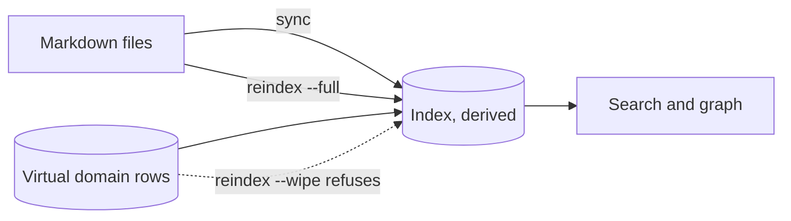

# Architecture

Eight crates, one daemon and one rule: every domain has exactly one source of truth, and the index is derived.

```
crystalline-core       format layer: parser, emitter, Picoschema, verify, prompt
       |         \      (no async runtime, no database, no ML - stays static)
       v          v
crystalline-index      crystalline-remote  GitHub-backed team collaboration plumbing
       |
       v
crystalline-identity   accounts, roles, domain access, joins and scope
       |
       v
crystalline-engine     the shared engine, review-mode overlay, origins, co-editing sessions
       |
       v
crystalline-rest       the JSON API, sign-in and the co-editing socket
       |
       v
crystalline-service    single-instance daemon, MCP tool router, control protocol
       |
       v
crystalline (cli)      the one user-facing binary
```

Exactly one process ever holds the database open: the first `crystalline mcp` or `crystalline serve` takes an advisory lock and becomes the daemon. Every later CLI command or MCP connection attaches to it over a local socket, or opens the database directly for a brief operation when no daemon is running.

One principle runs through the whole stack: every domain has exactly one source of truth (markdown files on disk by default, the database itself for a [virtual domain](virtual-domains.md)), and the search index is always a derived, disposable layer. `crystalline reindex --full` re-reads every file and rebuilds it at any time, and `crystalline reindex --wipe` sets a database that will not open aside and starts over. For a file domain, index corruption or a schema change is never a data-loss event: each domain keeps the rows it has until its own rebuild commits, and a paragraph whose text did not change keeps the embedding it already had (the generated `index.md` files stay outside the index, as always). `reindex --wipe` throws the index away and re-embeds from scratch, which on a large corpus is hours. A virtual domain has no files behind it, so nothing can rebuild one: `--wipe` refuses while either your configuration or the index names a virtual domain and points at `crystalline domain export` first.

One source of truth, one derived index:


