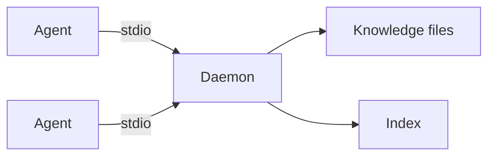
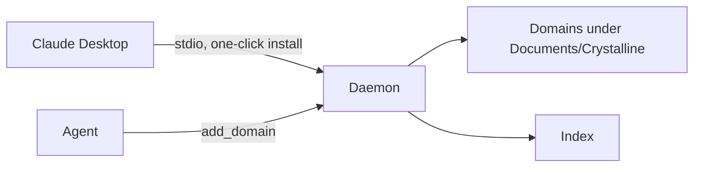
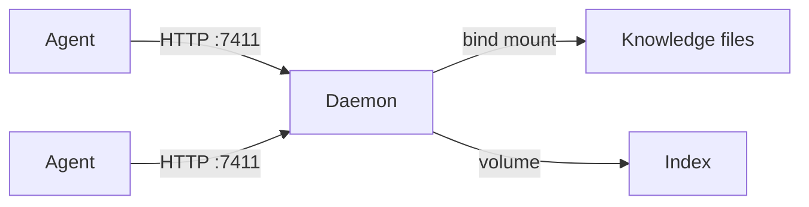
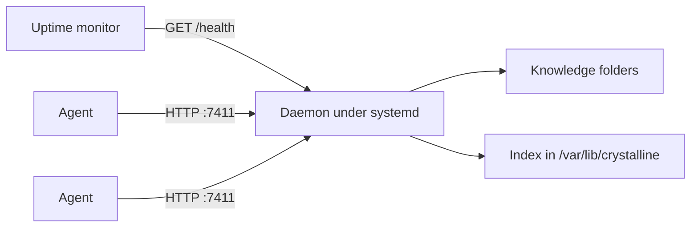
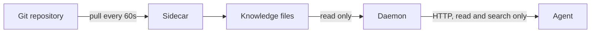
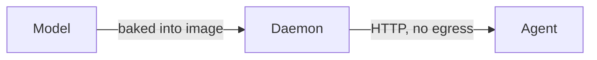
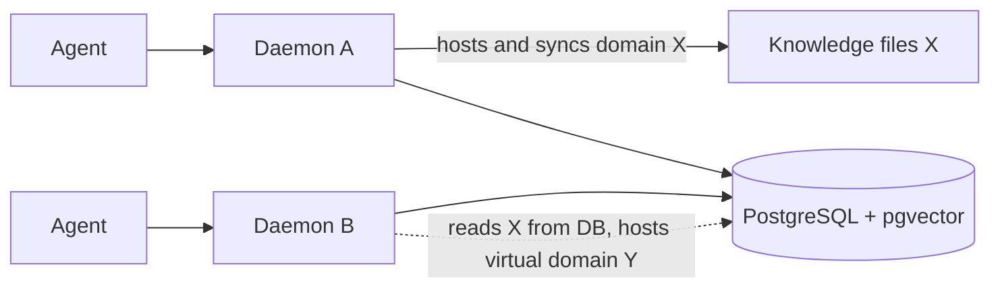
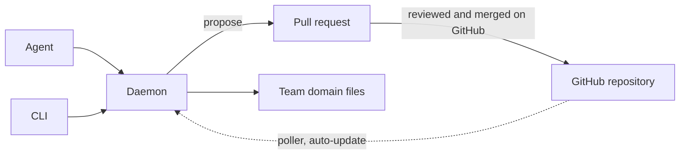

# Deploy Crystalline

Crystalline runs the same way in every scenario: a daemon in the middle keeps one search index in sync with knowledge, and one or more agents connect to it, whether that connection is a local stdio pipe or a network HTTP endpoint. The eight scenarios below are variations on that one architecture.

See [Get started](../README.md#get-started) in the README to install the binary and wire up an agent; this guide covers where the daemon, its knowledge and its index live in each shape.

## Personal workstation

The default shape: install the binary, point one or more agents at `crystalline mcp` over stdio, and the first connection spawns a background daemon that loads the embedding model once and watches every registered domain. Knowledge lives in ordinary local folders, read-write, so capturing what an agent learns as it works is the entire point. See [Get started](../README.md#get-started) in the README for the stdio setup.



### Daemon lifecycle

It does not matter who or where starts the daemon. The first `crystalline mcp` connection spawns it as a fully detached process (its own session, no controlling terminal, stdio closed) that serves the user's state directory and outlives every client that connects to it; later connections and plain CLI verbs attach to the same daemon over its local socket. Stopping it is one command, `crystalline ctl shutdown`, and the next connection simply spawns a fresh one.

Upgrades need no manual restart: attaching is version aware, so the first client built from a newer binary (after a `brew upgrade`, say) asks the older daemon to shut down gracefully and a new daemon starts on the current version. The takeover is one-way - an older client attaches to a newer daemon rather than displacing it back. Agent sessions ride through the swap, because the stdio bridge reconnects when its daemon goes away, replays the MCP handshake and answers any request the restart orphaned with a retryable error instead of silence.

## Claude Desktop extension

For someone who never opens a terminal, the `.mcpb` bundle wraps the same binary in a one-click Claude Desktop extension. It takes no configuration and starts with no domains: under the hood Claude Desktop spawns `crystalline mcp` over stdio, landing on the same daemon as the personal workstation shape. The agent creates a domain whenever it needs somewhere to capture knowledge, with the `add_domain` tool - a folder of markdown files under `Documents/Crystalline` (the default domains root, overridable with `domains_root` or `CRYSTALLINE_DOMAINS_ROOT`), a database-backed virtual domain or a GitHub team domain. Onboarding is automatic - the server's instructions deliver the routing block on every connection, empty at first - and the release's crystalline-claude-desktop-skill zip adds capture and collaboration best practices as an uploadable skill (see [Skills](../README.md#skills) in the README).



Sometimes the bundled binary can neither reach the daemon nor take the index lock, typically because the extension is older than a Crystalline installed another way (a Homebrew install after a `brew upgrade`, say). The session still connects instead of failing: the server comes up degraded with a single `status` tool and instructions that tell the model (and through it the user) to download the latest extension from the GitHub releases page and install it over the current one. Claude Desktop has no in-app update mechanism for an extension, so installing the downloaded `.mcpb` over the existing one is the update path.

## Team server

For a team, run the GHCR image (see [Run in a container](#run-in-a-container)) via `examples/docker/compose.yaml`: the daemon listens on `--http 0.0.0.0:7411` and every agent on the network reaches it over streamable HTTP instead of stdio. Knowledge is bind-mounted from the host so it stays exactly the same markdown files, a `/data` volume holds the disposable index, and the slim `latest` image downloads the model into that same volume once (pick `with-model` instead to skip the download). Agents that reach the daemon by a hostname rather than `localhost` need that host in `CRYSTALLINE_SERVICE_ALLOWED_HOSTS` (the transport validates the `Host` header; see [Configure through environment variables](#configure-through-environment-variables)). See [Run in a container](#run-in-a-container) for the compose file and image tags.



## Linux server with systemd

The team server shape without a container: the `.deb` ships a systemd unit,
installed disabled, so installing the package never starts anything. Put any
overrides in `/etc/default/crystalline` (bind address, read-only mode, team
domains - the same variables as [Configure through environment
variables](#configure-through-environment-variables)) and turn the service on:

```sh
sudo systemctl enable --now crystalline
```

The unit runs `crystalline serve` in the foreground under a dynamic service
user: the index and socket live in `/var/lib/crystalline`, the model cache in
`/var/cache/crystalline` and the config in `/etc/crystalline/config.yaml`.
HTTP binds `127.0.0.1:7411` by default; set
`CRYSTALLINE_SERVICE_HTTP=0.0.0.0:7411` in `/etc/default/crystalline` to let
agents on the network learn from it, and probe `GET /health` from a load
balancer or uptime monitor without an MCP handshake. The sandbox makes the
filesystem read-only outside those directories, so grant each knowledge
folder a write allowance with a drop-in: `sudo systemctl edit crystalline`,
then `ReadWritePaths=/srv/knowledge` under `[Service]`. Check on the daemon
with `systemctl status crystalline` and `journalctl -u crystalline` rather
than `crystalline ctl` (the daemon's socket lives under the service user, out
of reach of a login shell). A tarball install gets the same unit from the
repository at `crates/cli/debian/crystalline.service`, copied to
`/etc/systemd/system/` with ExecStart adjusted to where the binary landed (a
standalone binary is often `/usr/local/bin/crystalline`). Upgrading the
package restarts the service only if it is running; a disabled unit stays
untouched.



## Published read-only domains

When a team curates knowledge as a reviewed git repository instead of writing into the container directly, `examples/docker/compose.git-sync.yaml` adds a sidecar that pulls the repository into a shared volume every 60 seconds and mounts it read-only into Crystalline. The daemon runs with `--read-only`, so the four content-mutating tools disappear from the MCP tool list and agents can only search and read, while sync, the file watcher and embedding keep following every pull. A team domain connected to a GitHub origin (see [Team knowledge on GitHub](#team-knowledge-on-github)) gets the same effect natively, no sidecar container needed: `update_domain` and `origin_status` stay visible even in read-only mode, so a read-only instance keeps a team domain current on its own background poll schedule. A third option needs no mounted config and no sidecar at all: an immutable image started with `CRYSTALLINE_SERVICE_READ_ONLY=true`, `CRYSTALLINE_GITHUB_ENABLED=true`, one or more `CRYSTALLINE_DOMAIN_<NAME>` and `CRYSTALLINE_DOMAIN_<NAME>_ORIGIN` pairs and `CRYSTALLINE_GITHUB_TOKEN` for a headless sign-in bootstraps each team domain itself on first start and keeps it current on the same background poll schedule, with nothing left to mount or edit ever again. See [Read-only deployments](#read-only-deployments) and [Configure through environment variables](#configure-through-environment-variables) for the full behavior and variable list.



## Air-gapped or egress-restricted

When a host has no outbound network access, or the first-start model download delay is unwanted for any other reason, use the `with-model` image, or set `CRYSTALLINE_MODELS_DIR` on any install to point at a model directory fetched ahead of time, so nothing in the runtime path ever needs the network. This is orthogonal to read access: combine it with either the read-write [team server](#team-server) shape or the read-only git-sync shape, since air-gapping is about the model rather than about who can write. See [Run in a container](#run-in-a-container) for the image variants and `CRYSTALLINE_MODELS_DIR`.



## Shared database collaboration

When several instances should share one index instead of each keeping its own, point them at a shared PostgreSQL database with pgvector using `examples/docker/compose.postgres.yaml`: an immutable image with `CRYSTALLINE_DATABASE_BACKEND=postgres` and `CRYSTALLINE_DATABASE_URL` set, no mounted config.yaml needed. Every instance searches and reads everything in the shared database, so knowledge one instance captures is immediately visible to the rest. Writes follow a single-writer-per-domain rule: each file domain has exactly one hosting instance that syncs and watches its files. Hosting is arbitrated by a host lock with a 30 second heartbeat and a 90 second stale takeover, so a second instance that tries to sync a domain it does not host is refused with the name of the current host and serves that domain read-from-database only. A virtual domain keeps its engrams in the database itself rather than on disk, so it is shared truth that any instance may write, guarded per engram by a compare-and-swap on the checksum so a stale edit is refused rather than silently clobbered. The local-first guarantees hold for a running daemon against a local database; a remote database trades some latency for the federation payoff.



## Team knowledge on GitHub

For a team that keeps a domain in a GitHub repository instead of a shared filesystem or database, each repository (optionally a subfolder of one) becomes a team domain, with an origin recording which repository, subfolder and branch it tracks. Members connect once with a short code confirmed in a browser they are already signed into: no git, no SSH keys and no token to paste for someone who only knows the GitHub web UI. Crystalline shares new knowledge as a proposal the team reviews and merges on GitHub itself, and brings each team domain up to date automatically in the background once its proposals merge; a genuine disagreement between local and team knowledge surfaces as a conflict, settled locally. A fleet of worker or agent hosts can join the same team domain with no interactive connect step at all: three environment variables - `CRYSTALLINE_DOMAIN_<NAME>`, `CRYSTALLINE_DOMAIN_<NAME>_ORIGIN` and `CRYSTALLINE_GITHUB_TOKEN` - register the domain, attach its origin and supply this machine's GitHub identity, so a new node bootstraps the domain itself and starts polling for updates on first start. See [Share knowledge with a team](../README.md#share-knowledge-with-a-team) in the README for the full verb set and the one-time connect flow, and [Configure through environment variables](#configure-through-environment-variables) for the fleet variant.



## Run in a container

Crystalline publishes a multi-arch OCI image (`linux/amd64` and `linux/arm64`) to GHCR on every release, for Linux server deployments. macOS and Windows have no OCI container runtime worth targeting here, so those platforms run the native binary (see [Install the binary](../README.md#install-the-binary) in the README); the container covers the Linux server case.

Two image variants ship under the same name, tag-selected:

| Tag | Size | Embedding model | Best for |
|---|---|---|---|
| `latest` (or a pinned `vX.Y.Z`) | ~15 MB | Downloads in the background on first daemon start (needs egress to huggingface.co once) | The common case: a host with normal internet access, where a short model download on first start is fine |
| `with-model` (or a pinned `vX.Y.Z-with-model`) | ~145 MB | Baked into the image, no download | Air-gapped or otherwise offline hosts, or anywhere semantic search must work from the very first `search` call with no warm-up delay |

Pick `with-model` whenever the host has no outbound network access or the first-start download delay is unwanted; pick the slim `latest` otherwise, since it is the smaller image to pull and update.

```sh
docker pull ghcr.io/jordiboehme/crystalline:latest
# or: docker pull ghcr.io/jordiboehme/crystalline:with-model

docker run -d \
  --name crystalline \
  -p 7411:7411 \
  -v "$(pwd)/knowledge:/knowledge" \
  -v crystalline-data:/data \
  ghcr.io/jordiboehme/crystalline:latest
```

What persists where:

- `./knowledge` (bind mount) holds the engrams of every file domain, one subfolder per domain - the durable state for file-backed knowledge, exactly the same markdown-plus-frontmatter files the native binary reads.
- `crystalline-data` (named volume, mounted at `/data`) holds the search index and the embedding model cache. For file domains it is fully rebuildable: losing it costs a `crystalline reindex --full` and a model re-download (skipped entirely on `with-model`, since its model lives outside `/data` and is never affected by the volume), never data. If you run virtual domains, their engrams are the source of truth and live here too, so back this volume up or `crystalline domain export` them to the bind mount to keep a file copy.

The `with-model` variant sets `CRYSTALLINE_MODELS_DIR` (also settable directly, on any install, to relocate the model cache anywhere else) to a path outside `/data` so the baked model is never shadowed by the `/data` volume mount. The bundled model is [BAAI/bge-small-en-v1.5](https://huggingface.co/BAAI/bge-small-en-v1.5), MIT licensed.

Both variants ship a built-in Docker `HEALTHCHECK` that probes `GET /health` with no shell involved (the image is distroless), so `docker ps` reports health directly and a Compose service can gate on `condition: service_healthy`. External monitors (a Kubernetes `httpGet` probe, an uptime checker such as Gatus, a load balancer) can probe the same `/health` endpoint directly rather than going through Docker's own health state.

Two sample Compose files ship under [`examples/docker/`](../examples/docker/):

- **`compose.yaml`** - the single-container setup above, plus a commented one-shot `domain init` / `domain add` recipe for bootstrapping a fresh domain (`domain add` indexes it immediately, routed to the running daemon over the shared `/data` volume).
- **`compose.git-sync.yaml`** - a scale-deployment variant that adds a sidecar keeping the knowledge folder synced from a git remote every 60 seconds, mounted read-only into Crystalline. This is the pattern for a team that manages engrams as a reviewed git repository rather than writing into the container directly.
- **`compose.postgres.yaml`** - the [Shared database collaboration](#shared-database-collaboration) setup: a Postgres service with pgvector plus a Crystalline instance pointed at it via environment variables, and a commented second instance showing how a second worker shares the same database. Reach for it when several instances should share one federated index instead of each keeping its own.

### Configure through environment variables

An immutable image with no `config.yaml` to mount or edit configures purely through the environment: every settings key maps mechanically to `CRYSTALLINE_` plus the key uppercased with dots replaced by underscores (`github.enabled` becomes `CRYSTALLINE_GITHUB_ENABLED`), plus a handful of variables covering what has no settings-registry key of its own:

| Variable | Maps to | Notes |
|---|---|---|
| `CRYSTALLINE_SERVICE_READ_ONLY` | `service.read_only` | `serve --read-only` still forces it on |
| `CRYSTALLINE_SERVICE_HTTP` | `service.http` | `serve --http` wins over it |
| `CRYSTALLINE_SERVICE_ALLOWED_HOSTS` | `service.allowed_hosts` | comma-separated `Host` allow-list; loopback is always allowed and a single `*` allows any Host; `serve --allowed-host` wins over it |
| `CRYSTALLINE_SERVICE_RESPONSE_FORMAT` | `service.response_format` | `toon` (token-efficient list results, default) or `json` |
| `CRYSTALLINE_DATABASE_BACKEND` | `database.backend` | `turso` or `postgres` |
| `CRYSTALLINE_DATABASE_URL` | `database.url` | |
| `CRYSTALLINE_GITHUB_ENABLED` and the other `github.*` keys | `github.enabled`, `github.poll_secs`, `github.api_url`, `github.oauth_client_id` | |
| `CRYSTALLINE_SEARCH_SALIENCE_WEIGHT` | `search.salience_weight` | 0.0 to 1.0 (default 0.15); how strongly a salient engram is lifted in hybrid ranking |
| `CRYSTALLINE_SEARCH_RETIRED_WEIGHT` | `search.retired_weight` | 0.0 to 1.0 (default 0.6, 1.0 disables); the ranking multiplier for deprecated, superseded, archived or legacy engrams |
| `CRYSTALLINE_CONFIG` | an alternate config file path | `--config` wins over it |
| `CRYSTALLINE_DOMAIN_<NAME>` | a domain rooted at that path, overlay only | never written to `config.yaml` |
| `CRYSTALLINE_DOMAIN_<NAME>_ORIGIN` | `owner/repo[/subpath][@branch]` | bootstraps the domain on first start |
| `CRYSTALLINE_GITHUB_TOKEN` | this machine's GitHub token | read-only; `connect github` refuses while set |
| `CRYSTALLINE_MODELS_DIR` | the model cache path | pre-existing, unchanged |
| `CRYSTALLINE_CHANNEL` | install channel marker | set to `mcpb` by the Claude Desktop extension manifest so degraded-startup copy tells the user to update the extension rather than the binary; not meant to be set by hand |

`<NAME>` in a domain variable is lowercased with underscores turned into hyphens for the domain name itself (`CRYSTALLINE_DOMAIN_TEAM_KNOWLEDGE` becomes the domain `team-knowledge`). Precedence, highest first: a command-line flag, then an environment variable, then `config.yaml`, then the built-in default; an environment value is never written back to the config file.

## Read-only deployments

Pass `--read-only` to `serve` (or to `mcp`), set `service.read_only: true` in the config, or set `CRYSTALLINE_SERVICE_READ_ONLY=true` (the container-native spelling, see [Configure through environment variables](#configure-through-environment-variables)) to serve the content API read-only. The five write-gated tools (`write_engram`, `edit_engram`, `move_engram`, `delete_engram` and `add_domain`, which creates domains) disappear from the MCP tool list and are refused if a client calls one by name, while `search_engrams`, `read_engram`, `list_domains` and the rest of the read tools stay. Sync, the file watcher and embedding keep running, so the index still follows external edits such as a git pull. `crystalline prompt system` and the server's own initialize instructions follow the same mode: both drop the write guidance and state that the knowledge is curated externally, and `prompt system --read-only` forces that variant on demand. This is the natural pairing for the git-sync setup in `compose.git-sync.yaml`, where knowledge arrives by reviewed git commits and agents only consume it. The mode is fixed for the daemon's lifetime, so an agent attaching to a running daemon gets that daemon's mode. Operator tooling on the host (`verify`, `import`, `domain init`/`add`/`remove` and `model download`) is unaffected: the boundary is that the served API is read-only, not the machine.

Agents connect to the containerized daemon over its HTTP MCP endpoint, `http://localhost:7411` from the host (the image's default command is `serve --http 0.0.0.0:7411`, since a container has to bind every interface to be reachable at all - binding `127.0.0.1` inside a container is only reachable from inside that same container). The stdio `crystalline mcp` transport (see [Get started](../README.md#get-started) in the README) is for local, non-containerized processes; point a harness at the HTTP endpoint instead when Crystalline runs in a container. Every HTTP endpoint also answers `GET /health` with a static `{"status":"ok","version":...}` JSON body, so a load balancer or uptime monitor can probe the daemon without an MCP handshake.

The HTTP transport is Streamable HTTP (MCP protocol revision 2025-03-26 and later): every exchange is a POST whose response arrives as a minimal SSE stream carrying exactly the JSON-RPC message, with no optional SSE fields (no retry hints, no priming frames), so strict intermediary parsers - AWS Bedrock AgentCore Gateway among them - consume it cleanly. The deprecated 2024-11-05 HTTP+SSE transport is not served: a legacy client opening the old-style GET stream is answered with an immediate `400 Bad Request` naming the missing session id rather than a silent hang.

The HTTP transport validates the request `Host` header to block DNS-rebinding attacks, where a malicious web page tries to drive a reachable MCP server from inside the victim's browser. It answers only requests whose `Host` is on its allow-list, which is loopback by default (`localhost`, `127.0.0.1`, `::1`). That default already covers the `http://localhost:7411` access above with no extra configuration, and the bind address is independent of it: binding `0.0.0.0` changes nothing about which `Host` values are accepted. Reaching the daemon by any other name needs that name added - a compose service-name (`http://crystalline:7411`), a LAN hostname or IP, or a public hostname forwarded by a reverse proxy. Add it with `CRYSTALLINE_SERVICE_ALLOWED_HOSTS` (comma-separated) or the repeatable `serve --allowed-host <host>` flag; loopback stays allowed either way. A single `*` accepts any `Host` and turns the guard off, which is only safe behind a trusted reverse proxy or firewall that validates `Host` itself. A blocked request gets `403 Forbidden`; `GET /health` is never guarded, so probes keep working regardless. A reverse proxy that rewrites the upstream `Host` to `localhost` needs no allow-list entry; one that forwards the original public `Host` (the common default) needs that hostname listed.
