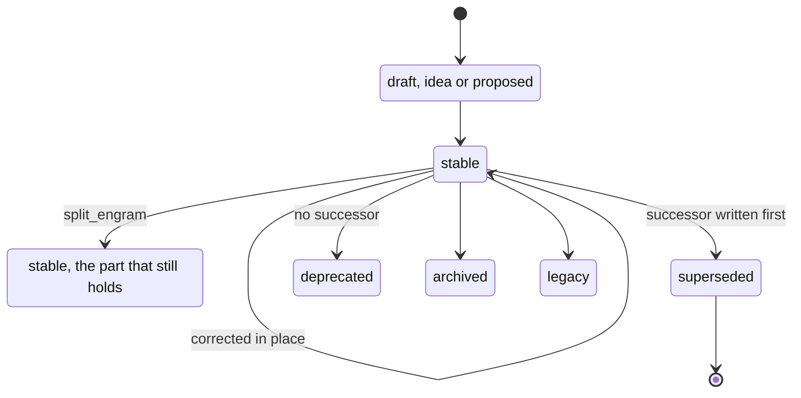

# Verify, evolve and doctor

Three checks ask three questions: does the format hold, is the machinery healthy and is the knowledge still true.

## Keep knowledge honest

`crystalline verify` statically checks one or more domains against the full rule catalog (malformed frontmatter, broken links, missing MANIFEST sections, schema drift) with no database, service or network connection involved. Its usual home is CI/CD on the GitHub repositories that hold a team's knowledge: every proposal is verified before the team merges it, so nothing malformed ever lands on the branch everyone pulls from. The bundled GitHub Action wires that up:

```yaml
- uses: jordiboehme/crystalline/action@v0.19.3
  with:
    paths: knowledge/       # space-separated domain roots, default '.'
    strict: 'false'         # promote Warning rules to Error
    version: v0.19.3        # crystalline binary tag to download, or 'latest'
```

The action ref (`@v0.19.3`) pins the action's own code. `version` pins the crystalline binary it downloads, so pinning both gives a fully reproducible check. The binary is checksum-verified, then the action runs `crystalline verify`, annotates the run and, on a pull request, posts a single summary comment kept up to date in place.

A domain can tune the rules in a `.crystalline.yaml` at its root: under `verify.rules`, each rule id takes `off`, `error`, `warning` or `info` (for example `Q002: off`). Verify never fails on a mistake in that file, but it no longer keeps quiet about one either: a value that is not one of those words, or a file that does not parse, is reported as `M108`, a warning against `.crystalline.yaml` that names the rule and the word. The rule it was meant for runs at its default. `--strict` turns `M108` into an error like any other warning, which is how a CI run catches an override that was silently lost.

Verify is one of three checks, and each asks a different question. `crystalline verify` asks whether the format holds. `crystalline doctor` asks whether the machinery around it (the index, the registered domains, the service) is healthy. `crystalline evolve` asks the question neither of the other two can: is the knowledge itself still true, and is it still well organized? A fourth command, the importer, brings an existing knowledge base under Crystalline in the first place:

- **`crystalline evolve`** sweeps one domain or every domain for the maintenance the knowledge needs and prints a ranked queue, each finding naming the engram, the evidence it fired on and the exact next action. The queue prints with an `Actions:` legend, one line per rule with the fix spelled out, a `Truncated:` note where a rule capped its output and `nothing to work in this scope` on a clean domain. It sees temporal and lifecycle debt (a `valid_to` that elapsed while the status still reads current, a `stale_after` past due, long-unverified knowledge, a retirement whose replacement landed but whose old engram was never flipped, substantive work that has sat unshared in a team domain for a week), structural gaps (unresolved `[[links]]`, one-sided relation pairs, orphans, oversized engrams and stubs), the still-valid observations a retirement is about to take down with it, and redundancy (near-duplicate clusters, semantic twins - the same knowledge in different words - and drifted tags). Narrow it with `--domain`, `--family`, `--rule` or `--min-priority`, and pass `--today` to evaluate the temporal rules as of a fixed date so a run reproduces. It is read-only and detects by dates, links, graph shape and embedding similarity, never confirming a contradiction, so it hands over work to do rather than rewriting knowledge on its own. It is the same sweep the `evolve_engrams` tool gives an agent. Run it after a big ingest, when two search hits disagree and a half-finished retirement is the likely reason, or on the first session of a month; it is deliberate maintenance you ask for, never a session-start ritual.
- **`crystalline doctor`** diagnoses the index, registered domains and service state (orphan index rows, encoding issues, stale service locks) and repairs what it safely can with `--fix`. Once team domains are turned on it also reports whether this machine is connected to GitHub and whether each team domain's local origin state is intact. When a domain ships provisioned artifacts, it reports every declaring domain's decision and shipped counts and every installed harness's drift, locally edited and orphaned counts against what was last reconciled. That part, like the GitHub checks, is always report-only: `--fix` never reconciles a harness.
- **`crystalline import <src> --domain <name>`** brings an existing markdown-plus-frontmatter knowledge base under Crystalline: normalizes legacy `type` values, backfills `status` and temporal metadata, drops sentinel far-future dates in favor of leaving the field open-ended, and records write provenance where a file carries none. It is all a pure file transformation, with `--dry-run` to preview first.

### An engram's lifecycle

The states a `status` names and the moves between them:



The values are guidance, not an enum: `stable` is the default and the word for knowledge that holds now (`current` is its older spelling). A fact that stopped holding is superseded, never overwritten: write the successor first, then flip the old engram to `superseded` with a `superseded_by` relation and close its window with the real `valid_to`, or leave the window open when the date is unknown. Not every retirement has a successor. When a practice is simply abandoned, flip the status, close the window when the date is known and carry any lesson worth keeping into a live engram; the retirement is the whole edit. Each retirement word means one thing: `deprecated` says do not do this again, `superseded` says a newer engram replaced this one, `archived` says retired but kept for the record and `legacy` says still deployed and true of old installations but not to be built on. `delete` is for mistakes, not history. The sweep flags the half-done moves: a successor that landed while the old engram still reads `stable`, a `valid_to` that elapsed under a live status, and a split that left a fact behind that should have moved.

### Browse a domain without Crystalline

Every folder of a file domain carries a generated `index.md`: a plain markdown listing of the engrams in that folder (title plus description, linked relatively) and of the subfolders below it. It is written after every write, edit, move, delete and sync, so a domain browsed in an editor, on a git forge or by any other tool navigates itself, with nothing running. The listing at the domain root additionally declares the knowledge format version with `okf_version: "0.2"`.

`index.md` and `log.md` are reserved filenames: Crystalline never indexes them, never searches them, never verifies them and refuses to file an engram under either name. The log is reserved only, never generated. Turn the generated listings off with `crystalline config set index.files false`. Existing files stay where they are and stay out of the index.
