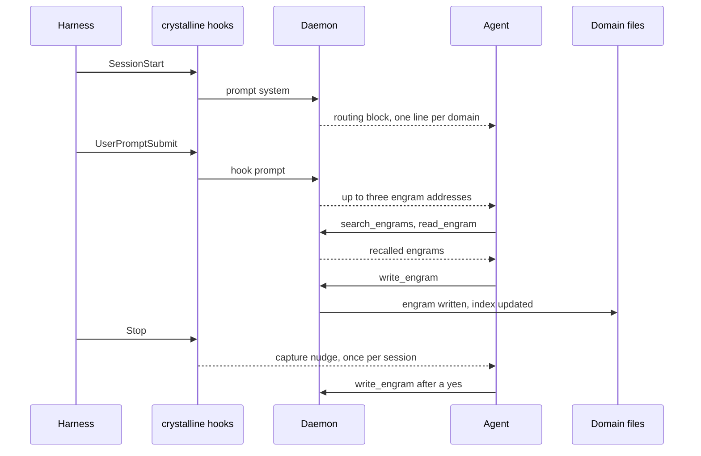

# How an agent learns

Onboarding at session start, recall while it works, capture before it ends: this page is the loop, the tools behind it and the skills that teach an agent to run it well.

## How it works

- **Domains** are folders of knowledge. Each one carries a `MANIFEST.md` describing its scope and when an agent should route a task there.
- **Engrams** are the unit of knowledge: one markdown file with YAML frontmatter, holding prose, observations (`- [category] a captured fact or lesson`) and relations (`- rel_type [[Other Engram]]`) to other engrams.
- **Built on an open format.** The engram format extends [Google's Open Knowledge Format (OKF) v0.2](https://github.com/GoogleCloudPlatform/knowledge-catalog/tree/main/okf): plain markdown with YAML frontmatter, readable by any OKF tooling, with no lock-in. Unknown keys are always preserved, and every engram records who wrote it and when, and an agent's capture records which model it was. Crystalline layers its routing, temporal and knowledge-graph conventions on top, so OKF documents drop straight into a domain and your knowledge stays portable, diffable files whatever tools come next.
- **Knowledge retires, it does not disappear.** When a fact stops holding, the old engram is superseded rather than overwritten: its `status` marks it as no longer current, `valid_from`/`valid_to` keep the past addressable by date ("what applied last June") and the lessons it taught carry forward as unbounded knowledge - the way a person still draws on a past job without mistaking it for the present. A retired engram stays in every search; it is only softly faded in ranking, so current knowledge surfaces first without the past ever going missing.
- **MANIFEST routing** lets an agent (or a person) figure out which domain owns a task without reading every file: `crystalline prompt system` turns each domain's `## When to Use` bullets into a compact session-start briefing.
- **Fluid** is the browser UI for an instance, and it is the half of this that is for people: Crystalline stores what was learned, [Fluid](fluid.md) is where you read, edit and think with it.

## Session onboarding

Every MCP client is onboarded automatically: the crystalline server's instructions, returned when a client connects, carry a live routing block. That block is one line per registered domain summarizing when to use it, plus the behavior rules (narrow question -> search that domain; broad question -> sweep all of them; writes always name a domain explicitly). The block names the exact crystalline tools each rule refers to (`search_engrams`, `write_engram` and the rest), so an agent with several MCP servers connected knows which tool on which server to call.

Domain lists and file-domain MANIFESTs are read fresh for every new connection; virtual-domain routing lines follow the daemon's latest snapshot, refreshed on every stdio connection and on every local virtual write. Claude Desktop and any harness that shows the model its MCP server instructions need no further setup. A harness installed on this machine with `crystalline install` is the one exception, and it needs no setup either: its own session hook delivers the block, so the server recognizes it at connect time and hands it a one-line pointer instead of a second copy (see [Skills over MCP](#skills-over-mcp)).

The block is sized for clients that truncate server instructions: the intro and the behavior rules come first and always fit, and the domain lines that follow shrink to one bullet each, then to a single count line, rather than pushing the rules out of view. Nothing is lost either way, since `list_domains` with `include_routing=true` returns the whole index on demand.

The same routing block is available outside MCP: `crystalline prompt system` renders it to stdout from every registered domain's `MANIFEST.md`, to feed to an agent as session context. Over MCP there is no workspace, so `prompt.rules` filters and repo-local `preferred_domains` apply only on this path. `crystalline prompt system --workspace .` scopes it to the current repository. `--domain <name>`, repeatable, renders only the domains you name, in the same order, in every output format. `prompt` takes a subcommand naming the kind of prompt to generate: `system` for hook-driven harnesses, `connector` for the snippet on [Remote clients](setup/remote-clients.md).

The generic harness recipe: run `crystalline prompt system` at session start and inject its stdout as context before the agent does anything else. In Claude Code that is a `SessionStart` hook in `settings.json`, matched on `startup|clear|compact` so the routing block is re-injected after `/clear` and after a compaction as well as on a fresh start (a resumed session is deliberately excluded, since its transcript already carries the earlier routing block). [Get started](../README.md#get-started) covers `crystalline install`, which writes this hook for you; by hand it is:

```json
{
  "hooks": {
    "SessionStart": [
      {
        "matcher": "startup|clear|compact",
        "hooks": [
          { "type": "command", "command": "crystalline prompt system" }
        ]
      }
    ]
  }
}
```

Any harness with an equivalent session-start hook can run the same command the same way.

## The learning loop

Experience only compounds when capture actually happens. The loop has three beats: the agent recalls what is known at session start, works with it and captures what it learned before the session ends. The last beat is the one agents skip when nothing reminds them, so `crystalline install` wires the reminder.

It is a `Stop` hook running `crystalline hook stop`: a once-per-session, late nudge that fires on the first stop after a session gains real substance. It stays silent otherwise: below the substance threshold, once it has already fired, in read-only mode or with no domain registered. When it fires, it asks the agent to review the conversation for durable learnings, propose capturing each one into the fitting domain (the same propose-first, wait-for-a-yes shape the capture skill follows) and raise the salience of any recalled engram that proved key to the task. Where a team domain holds work the team has not seen, one more line counts it and asks the agent to propose sharing it with `share_changes`. It is still a proposal to say yes to, since sharing publishes somebody's work for review.

The reminder costs about 120 tokens, at most once per session. Remove it with `crystalline uninstall <harness>`, or leave it out from the start with `--skip-hooks`.

There is a third hook: a `UserPromptSubmit` hook running `crystalline hook prompt`, installed for Claude Code, Codex and Copilot alike, so what an earlier session learned meets the agent when it is relevant, without it having to decide to search first. In Claude Code and Codex each prompt arrives with at most three engrams, named by `crystalline://` address, one line each - a head start to read with `read_engram`, not the answer itself. A given engram is named once per session, and again after `/clear` or a compaction. It costs about 200 tokens when it has something to say, and nothing when it does not: it stays silent without a running daemon, before the index has embeddings, or once `recall.enabled` is turned off; `recall.limit` and `recall.min_score` are its cap and its floor (3 and 0.69 by default). Copilot gets the same hook entry but has no channel yet for what it would say, so it stays installed and inert there.

One session, hook by hook:



## Teach and learn

The MCP server exposes 20 tools on a default writable instance: 19 in a harness whose install already carries the skills as files, 10 serving read-only. The six collaboration tools appear beside them once `github.enabled` is turned on (see [Share knowledge with a team](teams.md#share-knowledge-with-a-team)). That takes a read-only instance to 12, not 16, since only `update_domain` and `origin_status` read without writing. The list is the same for every client connected at that moment. Capturing knowledge as a byproduct of work is the core loop:

- **`write_engram`** - capture a new engram. `domain` is always required (there is no default domain for writes, so an agent never writes into the wrong place). `permalink`, `status` and `recorded_at` are filled in for you. The receipt may name the three existing engrams closest in meaning to what was written, so the write is also a search.
- **`search_engrams`** - search before writing, and search to recall what is already known. Defaults to hybrid text-plus-semantic ranking across every domain; pass `domains` to narrow it, or filter by `type`, `tags`, `status` or arbitrary `metadata_filters` with no query text at all.
- **`edit_engram`** - refine an engram in place (`append`, `prepend`, `find_replace`, `replace_section`, `insert_before_section`, `insert_after_section`, `set_frontmatter`) instead of creating a duplicate for the same topic. `set_frontmatter` assigns one lifecycle field by name: `status`, `valid_from`, `valid_to`, `stale_after` (legacy spelling `review_after`), `source_date`, `salience` or `verified`. Retiring an engram or recording a re-check is then a field assignment rather than a text substitution.
- **`split_engram`** - move part of an engram into a new engram of its own, in one step. Validity is set per engram rather than per bullet, so when one fact in a bundle stops holding while the rest still does, split before you retire. Name the observation lines or the section headings that move, and the call writes the new engram with the source's tags and a `stable` status and links the pair with `derived_from` and `split_into`. That leaves the source holding exactly what expired, and the facts that still hold addressable on their own.
- **`build_context`** - given a `crystalline://domain/permalink` anchor, follow its relations and links (across domains too) to assemble the neighbourhood around a task before diving in. The neighbourhood comes back ranked by how strongly each engram connects to the anchor, salience-aware, so `max_related` keeps the most relevant.
- **`vocabulary`** - list the tags, observation categories, relation types and engram types and statuses already in use, with counts, and reuse an existing term before coining a near-duplicate.
- **`remove_domain`** - unregister a domain the agent should stop learning from, the counterpart to `add_domain`. The registration and the search index rows go and the knowledge does not: a folder domain's markdown stays on disk (point `add_domain` at the folder again and it is re-adopted) and a team domain's GitHub repository is never touched. A team domain is reconnected with its repository rather than with its folder, which is what the confirmation says. A virtual domain is the exception, since its engrams live in the database and are deleted with it, so every surface refuses until the removal says `purge`. On your own machine you may remove any domain; on a shared instance it takes an instance admin, or a private domain's owner.
- **`evolve_engrams`** - ask what the archive needs instead of waiting to trip over it: a read-only sweep of one domain or all of them that returns a ranked maintenance queue, every finding carrying the evidence it fired on and the exact next action. It sees temporal and lifecycle debt (a `valid_to` that elapsed while the status still reads current, a `stale_after` past due, a replacement that landed while the retirement was never finished), structural gaps (unresolved `[[links]]`, one-sided relation pairs, orphans, oversized engrams and stubs), the still-valid observations a retirement is about to take down with it, and redundancy (near-duplicate clusters, semantic twins - the same knowledge in different words - and drifted tags). A finding marked `mechanical` completes intent the archive already records; one marked `judgment` changes what the archive claims and wants a yes first. It is the tool behind `crystalline evolve`.

Attachments run the same loop in the other direction: files enter through Fluid (or a domain archive), never through an agent write, and reach an agent as resource links on `read_engram` that `resources/read` fetches by URI. So the slide deck a person drops onto an engram is something the next session reads and learns from rather than an opaque blob, and `evolve_engrams` raises a finding whenever a fresh or changed file still needs capturing.

Observations are the atomic unit of an engram's body: top-level bullets like `- [decision] we chose Postgres for the write path #database`. Categories are free text; useful ones are `decision`, `fact`, `pattern`, `gotcha`, `convention`, `lesson`, `risk`, `insight`, `idea`, `proposal` and `poc`. Relations connect engrams: `- depends_on [[Other Engram]]`, or `- "relates to" [[Other Engram]]` for a multi-word relation type.

A long source can be kept word for word, but only beside its distillation, never instead of it. The summary is an ordinary engram where its topic lives; the full text goes in as a `type: source` engram under a `sources/` folder, and the two link both ways with `summarizes` and `summarized_by`. A `type: source` engram may be four times the ordinary verify token budget (10000 tokens by default), and a text still over that becomes sequential part engrams.

Temporal fields are plain and easy to get wrong by overthinking them: an absent `valid_from` means the engram has always been valid, an absent `valid_to` means it is valid forever. When set, the fields are plain ISO dates (YYYY-MM-DD) at day granularity, and the write drops a sentinel far-future value outright, since absence already means forever. Set them only when a fact is genuinely time-bounded (a policy that changes on a known date, a temporary workaround). `status` and `type` have recommended value sets stated in the tool descriptions themselves (status: `stable`, `implemented`, `draft`, `proposed`, `idea`, `poc`, `deprecated`, `superseded`, `archived`, `legacy`; type: `engram`, `guide`, `decision`, `architecture`, `runbook`, `reference`). `stable` is the default, and `current` is its older spelling for the same state. The sets exist so an agent can tell an idea apart from current fact, and they are guidance, never a global enum a write is rejected for.

`crystalline://<domain>/<permalink>` is the one absolute form of an address. An identifier without the scheme is domain-relative, so pass a bare permalink and name the domain separately.

Exceptionally valuable knowledge can carry a numeric `salience` key (0 to 10) in `metadata`, the way a memory formed during an exceptional event encodes more strongly: hybrid search adds a small bounded lift for it, so a salient engram ranks above equally relevant unmarked ones while relevance keeps the upper hand and nothing is ever filtered out by it. An agent raises it later on an engram that proved to be the key to a task; the lift's strength is the `search.salience_weight` setting (0.0 to 1.0, default 0.15, 0 disables it). The counterpart on the way out is `search.retired_weight` (0.0 to 1.0, default 0.6, 1.0 disables it): an engram whose `status` is `deprecated`, `superseded`, `archived` or `legacy` is softly faded by it in ranking, never filtered out.

The CLI mirrors the mutating and read tools directly for scripting and quick edits outside an agent session: `crystalline write`, `read`, `edit`, `move`, `split`, `delete`, `search`, `context`, `recent` and `vocabulary` take the same parameters as their MCP counterparts.

Tag identity is case-folded, so `Foo` and `foo` are the same tag; the files keep whatever case you wrote. For the rest of tag drift - a separator swap or a plural - `crystalline vocabulary` and `crystalline doctor` surface near-duplicate clusters, and two CLI-only commands consolidate them: `crystalline tags rename <old> <new>` and `crystalline tags merge <old> <into>`. Both rewrite only the tag tokens, preview before writing and take `--dry-run`, `--yes` and `--domain`. A merge also records the fold in the MANIFEST's `## Tag Aliases` section, one line per fold as `- old -> canonical`, so a search for the old name keeps resolving forever. Bulk rewrites are deliberate maintenance, which is why these live on the CLI rather than as MCP tools.

## Skills

The `skills/` folder ships four harness-agnostic agent skills plus one consolidated skill, teaching an agent how to use Crystalline well:

- **`crystalline-routing`** - which domain(s) to search for a task, when to sweep every domain instead, temporal filtering for "what is true now", and when to fall back to reading a MANIFEST directly.
- **`crystalline-capture`** - when captured knowledge is worth writing down, searching before writing to avoid duplicates, editing an existing engram instead of forking the topic, and the observation-category and temporal-field conventions that keep engrams useful later.
- **`crystalline-schema`** - authoring a Picoschema schema engram for a domain that wants structure, inferring one from what is already captured, and validating conformance.
- **`crystalline-collaboration`** - working in a domain that has a team origin: checking status at session start, updating before deep work, sharing a coherent unit of knowledge as a proposal and relaying its review URL, conflict etiquette and connecting a new teammate end to end.
- **`crystalline-intelligence`** - a single consolidated skill for Claude Desktop and other harnesses that install one skill at a time: recall, capture, read-only stand-down and team sharing essentials in one file.

`crystalline install claude-code` (or `codex` or `copilot`) copies these same four skills into place automatically - `~/.claude/skills` for Claude Code, `~/.agents/skills` for Codex, `~/.copilot/skills` for the Copilot CLI - and leaves `crystalline-intelligence` alone, since it is Claude Desktop's own consolidated skill. Each is a plain folder with a `SKILL.md`; to do it by hand instead, copy the folder into wherever your harness looks for skills. For Claude Code, that is `.claude/skills/` in a project or `~/.claude/skills/` globally:

```sh
cp -r skills/crystalline-routing skills/crystalline-capture skills/crystalline-schema skills/crystalline-collaboration ~/.claude/skills/
```

Installed skills stay current on their own: each install is recorded in a local receipt and when a new crystalline version first runs it refreshes the installed skills at session start - updating changed ones (an edited copy is kept beside the new one as `SKILL.md.bak`) and removing ones the new version no longer ships.

Installing from a release instead of a clone: download `crystalline-agent-skills-v<version>.zip` from the [latest release](https://github.com/jordiboehme/crystalline/releases/latest) and unpack it into `~/.claude/skills/`. Zip installs are not tracked by the receipt, so re-unpack the zip after upgrading crystalline (or run `crystalline install` once to switch to managed skills). The Claude Desktop upload is on [its setup page](setup/claude-desktop.md).

Other harnesses that support a similar skill or instruction-file convention can point at the same folders directly; the content only assumes the MCP tools documented in [Teach and learn](#teach-and-learn), never a specific harness.

### Skills over MCP

Installing the folders is not the only way in: every server also serves the same five skills to remote clients that never run the CLI at all. A chat surface calls the `skills` tool - with no arguments it lists all five, by name it returns one skill's full `SKILL.md`. A harness whose agents read MCP resources instead reaches the same content at `skill://<name>/SKILL.md`. And a harness that shows the model MCP prompts can insert the `onboarding` or `connector` prompt directly, the same text described in [Remote clients](setup/remote-clients.md). All three are governed by the one `skills.serve` setting. Its default, `auto`, serves them to every client except a session spawned by a harness this machine has already onboarded: `crystalline install` registers the MCP server as `crystalline mcp --harness <name>`, and a session started that way asks the local install receipt whether that harness has its session hooks wired. If it has, it already carries the five skills as files and gets its routing block from its own hook, so it is served neither the skill surface nor a second copy of the onboarding block. Everything else is served in full, including a registration made before that flag existed, a harness the receipt does not know and every HTTP client - a remote client never ran the CLI here, so nothing on this machine says what it has.

`claude mcp get crystalline` (and the Codex and Copilot equivalents) shows whether a registration carries the flag, which is how to tell which answer a stdio session will get. Set `skills.serve` to `true` to serve everything to everyone regardless, or to `false` to serve the skills to nobody, for an operator who would rather ship them only as zips; either explicit value overrides the resolved answer and makes every client identical, on both transports. The value is read once when the daemon starts, so changing it with `configure` applies from the next start.

After upgrading from a version before this flag existed, an existing registration still reads plain `crystalline mcp` and the skill surface simply stays on, exactly as it was. To pick the flag up:

- **Claude Code:** rerun `crystalline install claude-code`. It reads the existing entry back and re-registers it in place. It only does that for an entry it recognizes as its own, in the scope it would write, carrying no environment block of yours; anything else it leaves untouched and prints the command you can run yourself.
- **Codex and Copilot:** rerun `crystalline install` does *not* repair those, because their `mcp get` output format has not been verified and an install that cannot read what it is repairing must not touch it. Replace the entry yourself: `codex mcp remove crystalline && codex mcp add crystalline -- crystalline mcp --harness codex`, and the same shape for `copilot`.

Either way this is an optimisation, not a fix: leaving it alone costs a duplicated routing block and six listed entries, nothing more. Setting `skills.serve` explicitly to `true` or `false` sidesteps it entirely.

## Ship tools with a domain

Teaching an agent what a domain knows is half the story. The other half is the working tools that knowledge depends on to act on it: skills, slash commands, subagent definitions and MCP server configs. A domain's `MANIFEST.md` can declare a `## Provisioning` section naming the folders it ships, one bullet per kind:

```
## Provisioning

- skills: skills
- commands: commands
- agents: agents
- mcps: mcps
```

Each bullet is `type: path`, one of `skills`, `commands`, `agents` or `mcps` (a folder of JSON configs for `mcps`). `path` is relative to the MANIFEST itself and may climb out of the domain root with `../` to point at a folder that lives beside it. The starter MANIFEST `crystalline domain init` scaffolds does not include this section - add it by hand once a domain actually ships something. Every artifact is authored once and translated into whichever harnesses' formats allow it, a markdown agent becoming Codex's TOML dialect and back again.

Nothing ships until a person decides to: an undecided domain surfaces at session start so the agent can raise it with the person at the keyboard, then applies the answer with the `provision` MCP tool or from the terminal:

```sh
crystalline provision allow engineering   # opt in, then reconcile
crystalline provision deny engineering    # opt out, removing anything already shipped
crystalline provision status              # every domain's decision, every harness's installed state
```

Bare `crystalline provision` reconciles every opted-in domain into every harness this machine has onboarded. It is idempotent and safe to rerun: installing what is missing, updating what changed and retiring what a domain no longer ships. A provisioned file you edited by hand is still brought current on the next reconcile, with your edited version kept beside it as a `.bak` copy rather than lost. A foreign file Crystalline never wrote is adopted when it already matches byte for byte and otherwise left untouched, never overwritten.
