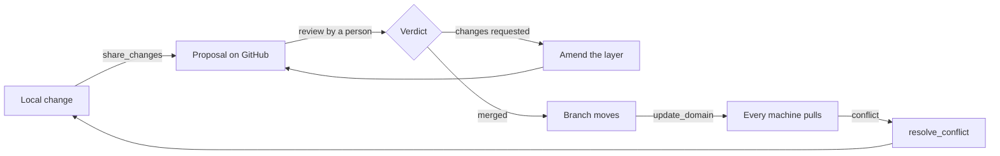
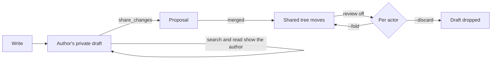

# Teams

A team shares knowledge through GitHub pull requests; this page is the whole lifecycle, from connecting a machine to review mode.

## Share knowledge with a team

A team domain is an ordinary domain whose files also live in a GitHub repository: local markdown stays the source of truth on this machine, and an origin records which repository, subfolder and branch it tracks.

Connect this machine to GitHub once:

```sh
crystalline config set github.enabled true
crystalline connect github
```

`connect github` opens a short code to confirm at github.com/login/device, or takes a personal access token via `--token` for someone who would rather skip the browser. Either way there is no git and no SSH key involved, since connecting only establishes this machine's GitHub identity. An agent does the same through the `configure` MCP tool, passing `connect: "github"` and relaying the code to the person at the keyboard.

Bring a team repository in as a domain:

```sh
crystalline domain add design --origin acme/design-knowledge --branch main
```

`--origin` takes `owner/repo` or `owner/repo/subpath` when the domain is a subfolder of a bigger repository. The local folder defaults to `<domains_root>/<name>` (the domains root is `~/Documents/Crystalline` unless you set `domains_root` or `CRYSTALLINE_DOMAINS_ROOT`), and the domain is downloaded and indexed immediately. An agent does the same with the `add_domain` MCP tool.

From there, `crystalline origin` covers the team domain lifecycle:

- **`origin status [--domain <name>] [--files]`** - where a team domain stands: ahead (by change kind, so deletions never read as new notes), behind, open and declined proposals, unresolved conflicts, and which GitHub identity this machine reads and shares as. `--files` names the unshared paths under each domain instead of only counting them.
- **`origin update [--domain <name>]`** - bring a team domain (or every one) up to date with what the team has merged.
- **`origin share <name> [--title <t>] [--message <m>] [--proposal <n>] [--file <path>]`** - share local changes as a proposal the team reviews on GitHub. It refuses while a conflict is unresolved, so the team always reviews a clean proposal. Sharing again while a proposal is open stacks a new proposal on top of it, `--proposal <n>` amends that layer instead, and `--file` (repeatable) shares only the paths you name; on a domain whose MANIFEST declares `sharing: direct` the share commits straight to the branch instead.
- **`origin resolve <name> <path> --keep mine|theirs`** (or `--content-file <f>` for a hand-merged result) - settle a flagged conflict.
- **`origin withdraw <name> [--proposal <n>] [--revert]`** - close a proposal on GitHub and clear its record. Withdrawing a layer that is not the top one lifts its content out of the layers above and repairs the chain, and `--revert` also restores shared files that were not touched since sharing.
- **`origin diff <name> [--path <p>]`** - see what changed in each unshared file as a unified diff of the team's copy against yours, offline; `--path` narrows it to one file and `--json` returns both sides per file.
- **`origin discard <name> --path <p> [--path ...] [--yes]`** - put chosen unshared files back the way the team has them, offline: a modified engram gets the team's copy back, an added file is deleted, a deleted file is restored, and in a domain that reviews changes your own drafts of them are cleared. It previews first and asks; a file that changed since you looked is refused rather than overwritten, and nothing reaches GitHub.

From a local change to everyone's pull:



Where the forge serves stacked pull requests (github.com does, and Crystalline probes for it once per origin), a domain builds a stack rather than one long-running proposal: each share is its own focused review unit sitting on the one below, and reviewers merge bottom-up, so merging the top proposal lands the whole chain in a single click. Answering a review means amending the layer it belongs to (`--proposal <n>`, or `proposal` on the `share_changes` tool), which re-bases every layer above it automatically. Withdrawing a middle layer repairs the chain the same way, and a chain wedged by a declined layer heals on the next share or withdraw. On a forge without stacked pull requests, or with `github.stacks` turned off, a domain keeps a single living proposal that sharing updates in place instead: same number, same URL.

A share carries the domain's whole unshared delta by default, and can be narrowed to a subset of it: `--file <path>` on the CLI, repeated for several; a `files` array on the `share_changes` tool; per-file checkboxes in Fluid's share dialog. Where the domain shares its generated listings (see below), the `index.md` of each chosen file's own folder rides along so the repository stays browsable and no listing disagrees with the folder it describes, while a folder with nothing selected keeps its refresh for a later share. A path that is not among the domain's unshared changes refuses and names itself rather than being quietly dropped. Whatever you leave out simply stays an unshared local change. On an instance several people work in, Fluid's dialog opens with your own changes ticked, matched by the last writer each file's frontmatter records (a correctable heuristic rather than authorship enforcement, so anyone may tick or untick anything), and the line beneath the list counts what it left out, with unattributed changes and deletions counted as somebody else's. The share button carries the same count as a badge, its tooltip spelling it out as "2 of 5 unshared changes are yours" where that attribution exists. Be clear-eyed about what scoping is for on such an instance: a local edit is visible to everyone using the instance the moment it is written, because the working tree is what they all read, so choosing files decides what the team is asked to review on GitHub, not what colleagues can see. Before you share, both sides of every unshared file are one press away: in Fluid's share dialog a path opens a diff pane and a row's menu discards it, an engram page that differs from the team's copy wears an `Added` or `Changed` chip (`Draft` in a domain that reviews changes) whose menu shows the change, shares just that file or discards it, and `crystalline origin diff` and `origin discard` do the same from a terminal. Discarding never touches GitHub.

Whether those listings travel at all is the domain's own choice, declared once in the MANIFEST every member holds, as frontmatter rather than a section, since it is a switch and not a list:

```yaml
generated_indexes: shared
```

A folder's `index.md` is derived from the files beside it, so either answer is defensible and the domain picks one for everybody. `local` is the default, including for a MANIFEST that says nothing: the listings are generated on each machine and stay there, never travelling with a share, never counting as unshared work and never proposed in either direction. That is what a busy team wants, because two proposals touching the same folder both regenerate that folder's listing, and without this the second one conflicts the moment the first merges. `shared` is the deliberate opposite, and the choice to make when anything other than Crystalline reads the repository: the listings travel as ordinary files, every folder stays browsable on the forge, and the repository keeps the index files an OKF bundle is expected to carry. A value that is neither word is read as `local`, never as `shared`, and `crystalline verify` reports it as `M006`.

A repository that already carries committed index files keeps them when its domain moves to `local`. A share proposes nothing about them in either direction, on purpose: a file sitting right there on disk is never something to offer to delete. Clear them out of the repository by hand if you want them gone.

Whether a share is reviewed at all is the domain's choice too, declared the same way:

```yaml
sharing: direct
```

`proposal` is the default, including for a MANIFEST that says nothing: every share opens a proposal the team reviews and merges on GitHub, exactly as before. `direct` commits the selected files straight onto the connected branch in one commit, authored by the identity the share goes out on (the sharer's own under `github.share_identity = personal`, the instance credential otherwise) - no branch of its own, no proposal - and refuses while any proposal is still open, since that proposal is waiting to land on the very branch. A branch whose rules refuse direct commits answers with the way out: set `sharing: proposal` again, or ask a repository admin. A value that is neither word is read as `proposal`, never as `direct`, and `crystalline verify` reports it as `M007`. The policy is read from the MANIFEST at share time, off the domain's own folder, not cached from an earlier read. A policy change that a share pulls in applies to the next share. Both switches sit on the domain page in Fluid as the "Domain policies" card, where the domain's owner changes them without opening the editor.

By default every share, amend and withdrawal goes out on the one GitHub credential this machine is connected with. Set `github.share_identity` to `personal` and each of those writes goes out on the identity of the person doing it instead: proposals carry their GitHub name, so an approval is never an approval of your own identity's work, while pulls and every other read stay on the instance credential. Each person connects once, on the surface they share from: Fluid's profile card under GitHub identity for shares made in Fluid, or `crystalline connect github --personal` for the machine owner's shares from the CLI and locally attached agents (`--token <PAT>` skips the browser sign-in, and an admin sets up a bot account with `--as <account>`). Until they do, sharing and withdrawing refuse with that instruction instead of falling back to the instance credential. An agent reaching the instance over HTTP MCP shares as the account it authenticated as, so where agents authenticate (`auth.mcp`) each agent's proposals carry the name of the person whose token it holds. Where they do not, the agent belongs to nobody, so it shares as the account `github.agent_identity` names (usually that bot) and its shares are refused while the setting is unset. Personal mode asks one thing of the repository: every sharer needs write access to it, since proposals are branches in the same repository and never forks, so a maintainer adds each person as a collaborator once.

The same actions are MCP tools an agent calls directly: `update_domain`, `origin_status`, `share_changes`, `resolve_conflict`, `withdraw_proposal` and `discard_changes`, plus `configure` for settings and connecting. Review feedback flows back through `update_domain`, which returns each open proposal's review state and the reviewers' comments, so the agent can refine the engrams and share again into the layer that feedback belongs to, or relay the commit on a direct domain. These six need `github.enabled` turned on: while it is off they are not listed at all, so an install that never uses team domains carries none of them in its context. Turning the setting on makes them appear (from the tool, from `crystalline config set` or from Fluid's Connect button, all the same), and a client subscribed to change notifications is told the list moved. The setting is one shared switch rather than a per-client one, so every client connected at any given moment sees the same list. A client holding a list cached from before the switch went off still gets taught rather than confused: calling one of the six answers with the reason and the `configure` call that turns collaboration back on. `add_domain` is not among them: it creates domains of every kind (local, virtual, team) and is always available, though its team-domain branch still needs `github.enabled`. Sharing always ends with the agent relaying a URL to the person it is working with. On a domain that opens proposals it relays the review URL and a person merges it on GitHub; on a direct domain it relays the commit URL and nothing waits for a merge.

`crystalline config show`, `set <key> <value>` and `unset <key>` read and write the same settings registry the `configure` MCP tool exposes, today `domains_root` plus the `github.*`, `service.*`, `skills.*`, `database.*` and `search.*` blocks. Every settings key also maps to a `CRYSTALLINE_*` environment variable, so a container never needs to mount this file at all. See [Configure through environment variables](deployment.md#configure-through-environment-variables) for the full list. A domain's origin and the global `github` block look like this in `config.yaml`:

```yaml
domains:
  design:
    path: ~/Documents/Crystalline/design
    origin:
      repo: acme/design-knowledge   # the GitHub repository, owner/name
      path: knowledge               # optional subfolder; absent means the repository root
      branch: main                  # optional; absent means main
      poll_secs: 600                # optional per-domain poll interval override
github:
  enabled: true                     # turns team domains on; absent means off
  stacks: true                      # stack each share on the open proposal where the forge supports it; absent means on
  share_identity: personal          # instance (default) shares on this machine's credential; personal shares on each person's own
  agent_identity: share-bot         # the account whose connected identity unauthenticated HTTP agents share as in personal mode; absent refuses those shares
  poll_secs: 300                    # background poll interval in seconds; minimum 60
  api_url: https://github.example.com/api/v3   # GitHub Enterprise Server only
  oauth_client_id: abc123                       # a self-hosted OAuth App, GitHub Enterprise Server only
```

### Private domains

A domain does not have to be shared with the whole team to exist on a team instance. Make one private (from its Members card in Fluid, or `crystalline domain visibility <domain> private --owner <account>` from the CLI) and only its owner, the accounts invited into it and instance admins can see it at all. Everyone else gets the same answer a domain nobody registered gets. Be honest about what that protects: private is a wall between accounts, not from whoever operates the machine. The CLI, running on the host, administers every domain, invited or not, exactly the way a GitHub organization owner sees every repository in it. See [Private domains](deployment.md#private-domains) for membership levels and the full command set.

### Review mode

A domain can go a step further than shared: `review: overlay` turns its folder into reviewed truth, changed only by a merge that lands from GitHub, so the tree everyone reads stops moving the moment somebody saves. Every write in a domain like that (yours or an agent's) joins its author's own private draft instead of the file: search, read, `browse_domain`, `evolve_engrams` and the routing prompt all show your own drafts stitched into what the domain already shares, and nobody else's are visible to you. A `[[link]]` inside a draft still resolves against the shared tree only, never against another author's unshared words, so the graph an outsider walks never dead-ends into somebody's draft by accident. `share_changes` proposes exactly your own drafts, through the same review flow above. A receipt marked `draft` means the tree did not move, and only a merged proposal changes it. A reviewing domain also allows only one open proposal at a time, even where the instance's `github.stacks` setting is on: a second author's first share waits for the open one to merge, or is told to ask its author to withdraw it, rather than stacking a proposal beside it.

Turn review on with `crystalline domain review <name> overlay` (or Fluid's domain card, or the `CRYSTALLINE_DOMAIN_<NAME>_REVIEW` variable in [Configure through environment variables](deployment.md#configure-through-environment-variables)): it needs a GitHub origin, since review with nothing to propose into is a gate with no door, and a clean folder, refusing and naming the paths to share or revert first otherwise. Turn it off with `crystalline domain review <name> direct`, naming what happens to every actor's drafts (`--fold <actor>` writes theirs into the folder, `--discard <actor>` drops them), because disabling review ends every private draft in the domain, and the command prints that plan before it asks anyone to confirm it.

A write in a reviewing domain:



None of this needs a second person to be worth using. A one-person instance may put a domain in review mode too: with the agent authenticating as its own person, agent and person share the same draft and the same GitHub identity, so an owner-and-agent pair gates nothing extra by default. Review mode is simply the pause the owner already wanted before their own and their agent's work lands, made structural instead of a habit. Be honest about the one thing it does not stop: a file dropped straight into the folder by hand, outside any draft, still lands there (the folder is still the operator's), and `origin_status` names it under `out_of_band` rather than pretending review caught it.

A draft stays private to its author, with one deliberate door out: hand somebody a draft share-link (`dl_...`) and they pass it as `share_link` on `read_engram` or `edit_engram` to open that one draft of that one engram instead of a copy of their own. That is a grant scoped to a single page, revocable by the author, and the only way anyone but the author sees inside a draft before it is shared. Opening the same engram in Fluid, or reading it through a share-link, may land you in a live document instead: when somebody has that page open in the editor, an agent's read and its edits go through what they are looking at rather than the file behind it, landing under their cursor and naming the agent in the participant strip for a minute after each call (a colour chip over HTTP, "owner (agent: <client>)" when the agent is a local stdio session acting as the machine owner). That holds from the CLI too: `crystalline write --overwrite` onto a page somebody has open lands in their live document rather than replacing the file behind the room, and a retirement (delete or supersede) composes into it the same quiet way. A wholesale replace through the agent tools asks first rather than landing over unsaved work, and a client that cannot be asked is refused outright instead of overwriting silently.

