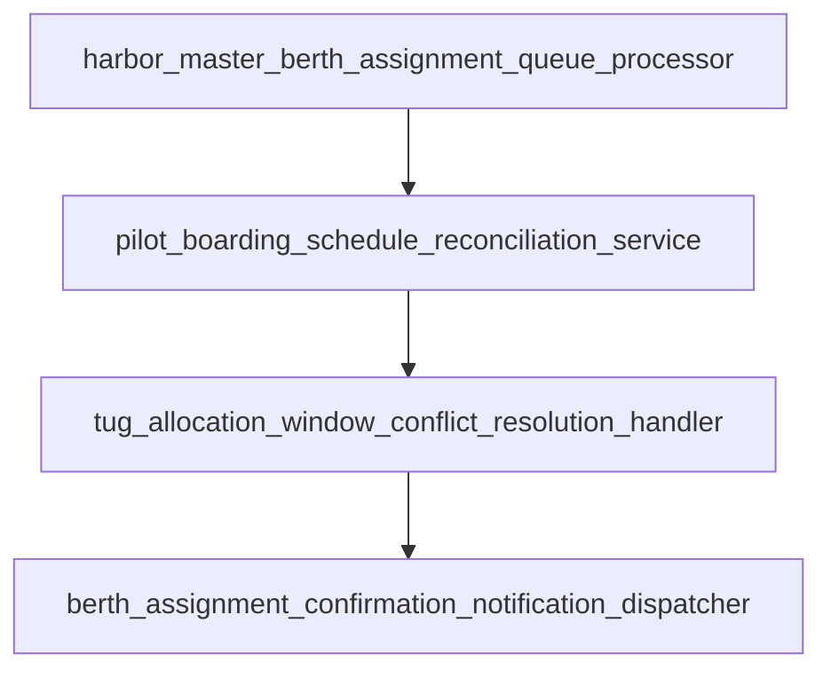

# Berth Assignment Flow

The diagram below exists so the browser smoke has long labels to measure under
page zoom.

```mermaid
flowchart TD
    A[harbor_master_berth_assignment_queue_processor] --> B[pilot_boarding_schedule_reconciliation_service]
    B --> C[tug_allocation_window_conflict_resolution_handler]
    C --> D[berth_assignment_confirmation_notification_dispatcher]
```
