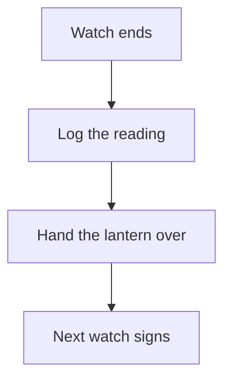

# Lantern Protocol

A lantern is handed over at the end of every watch, and the handover is
written down before the light changes hands. The diagram below is the whole
of it, and it is here so the browser smoke has a fence to render.

## Observations

- [requirement] The reading is logged before the lantern changes hands #protocol
- [gotcha] An unsigned handover is not a handover #protocol

## Relations

- relates_to [[Deep Gamma Note]]
- relates_to [[Harbor Signal Log]]
